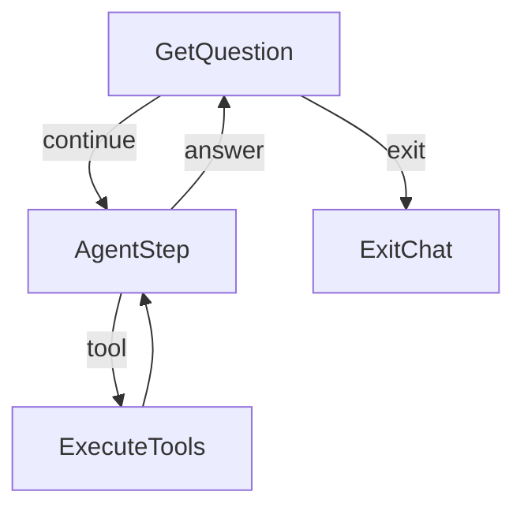

# deepseek-flow

Un agente de terminal construido sobre [PocketFlow](https://github.com/The-Pocket/PocketFlow)
(el framework de 100 líneas) con **DeepSeek V4.1 Flash** como LLM y una
arquitectura de **CORE + módulos**: un chat mínimo con capacidades de solo
lectura, y cada capacidad nueva que se agrega es un archivo que se deja en
`modules/` (y se quita borrándolo).



## Filosofía

Heredada de PocketFlow y de [bmo](../bmo) (el harness que inspiró los módulos):

- **Los datos exactos los cuenta el código; el LLM solo interpreta.**
- **Un módulo = un archivo** con `TOOLS` (esquemas) e `IMPL` (implementaciones).
  El registro los descubre al arrancar: agregar = dejar el archivo, quitar = borrarlo.
- **Todo bucle tiene presupuesto** (ley L8 de bmo): rondas de herramientas,
  rondas del juez, rondas de debate, pasos del supervisor.
- **Los errores son información**: un tool que falla devuelve `ERROR: ...`
  como texto y el modelo se autocorrige; la escritura de archivos exige
  aprobación humana (HITL) — `s/n` en la terminal, o desde el navegador
  con `HITL_WEB=1` — y EOF/Ctrl+C/timeout cuentan como rechazo.
- **El chat responde en vivo**: las respuestas se imprimen token a token
  mientras se generan (`CHAT_STREAM=1`, default) y un Ctrl+C durante la
  generación corta la respuesta conservando lo parcial (`CHAT_STREAM_INTERRUPT`,
  default 1); `0` en cualquiera vuelve al comportamiento clásico.

## Quickstart

```bash
pip install -r requirements.txt
cp .env.example .env        # ajusta lo que quieras
export DEEPSEEK_API_KEY=sk-...
python3 main.py             # el chat
```

Sin `.env`, el agente opera sobre el directorio actual (portable por defecto).

### En una PC nueva, el harness entero (Laya incluida)

Los checkpoints de Laya no van en el repo (643 MB cada uno, demasiado para
git) sino en una [release](https://github.com/poladb-afk/deepseek-flow/releases/tag/laya-v2);
un comando los baja, verifica y deja listos:

```bash
./descargar_modelos.sh
```

Sin ese paso el harness funciona igual — el router del chat y el Choose del
supervisor degradan al lado DeepSeek; solo se pierden los ifs locales (ms,
costo 0).

## Capacidades (22, al día de hoy)

| Origen | Herramientas |
|---|---|
| CORE (lectura) | `list_files`, `read_file`, `search_files` |
| escritura (HITL) | `write_file` — diff + `s/n`, default seguro |
| coding (HITL) | `run_command` — shell con `s/n`, timeout y salida truncada |
| coding (HITL) | `edit_file` — reemplazo exacto y único (diff quirúrgico) |
| HITL web | con `HITL_WEB=1` las aprobaciones se responden desde el navegador |
| juez | `answer_verified` — borrador → juez (verifica citas contra archivos) → refinamiento |
| juez (lote) | `juez_lote` — N preguntas verificadas EN PARALELO (`AsyncParallelBatchFlow`) + medición de speedup |
| informe | `run_informe` — map-reduce paralelo de trazas `.jsonl` |
| auditoria | `run_auditoria` — BatchFlow multi-carpeta + síntesis comparativa |
| research | `deep_research` — web + loop de cobertura |
| debate | `debate` — proponente vs crítico por colas + juez |
| supervisor | `run_supervisor` — bucle reactivo: Laya elige la herramienta de cada paso |
| db | `sql` / `db_schema` — SELECT de solo lectura sobre SQLite |
| effective_n | `run_effective_n` — deduplicación exacta por contenido (Effective N; 1 o varias carpetas, `BatchFlow`) |
| rag | `rag_search` / `rag_index` — búsqueda semántica local (fastembed) |
| memoria | `memory_search` / `memory_save` — biblioteca consultable entre sesiones |
| websearch | `search_web` — ddgs sin API key |
| mcp | `mcp_tools` / `mcp_call` — consume servidores MCP externos |

## Memoria entre sesiones

La memoria es una **biblioteca consultable**, no contexto auto-inyectado.
Cada chat arranca con la memoria vacía (nada entra al system prompt); el
agente la consulta por tools solo cuando el pedido lo justifica:

- `memory_search(query)` — busca texto (insensible a mayúsculas) en los
  markdown de `memoria/` y devuelve archivo+línea, más el listado de la
  biblioteca. Código puro, sin LLM.
- `memory_save(titulo, contenido)` — guarda `memoria/nota_FECHA_slug.md`
  con el título como primera línea. Sin HITL (es la libreta del agente)
  pero con contención dura: solo escribe dentro de `memoria/`, el nombre
  sale de un slug del título (sin rutas ni `..`).

Al salir del chat, si `MEMORIA=1` (default) y hubo al menos 2 preguntas,
**una** llamada a `call_llm` resume la conversación y la guarda como
`memoria/sesion_FECHA.md` (bookkeeping, sin HITL; si la llamada falla se
sale igual). `memoria/` no se versiona (está en `.gitignore`).

## CLI completo

```bash
python3 main.py                          # chat
python3 main.py juez "pregunta"          # respuesta con verificación de citas
python3 main.py juez_lote preguntas.txt  # N preguntas EN PARALELO (+ speedup medido)
python3 main.py informe [carpeta]        # map-reduce de trazas .jsonl
python3 main.py auditoria c1 c2          # multi-carpeta comparativa
python3 main.py research "tema"          # investigación web con loop
python3 main.py debate "tema" [--rondas] # debate multi-agente
python3 main.py supervisor "tarea"       # orquestación de piezas
python3 main.py effective_n [carpeta ...] # deduplicación exacta (1 o varias carpetas)
python3 main.py heartbeat [--ahora]    # piezas programadas (cron nocturno)
python3 main.py visor [trace.jsonl]    # HTML del trace (default: el último)
python3 main.py index [carpeta]          # indexar para RAG
python3 main.py carga_trazas.py          # (script aparte) jsonl → SQLite
python3 sonda_router.py [ckpt]        # (script aparte) router con compuerta
python3 main.py mcp-server               # exponer capacidades vía MCP
python3 main.py grafo [flujo]            # exportar los grafos a mermaid
```

Cada corrida deja un trace por nodo en `.runs/*.jsonl`.

## Estructura

```
deepseek-flow/
├── main.py            # entry point + subcomandos
├── nodes.py / flow.py # el CORE: bucle del agente
├── modules/           # capacidades del chat (TOOLS + IMPL por archivo)
├── informe|juez|juez_lote|auditoria|research|supervisor|debate|rag|mcp_server|effective_n|heartbeat|visor|carga_trazas.py
│                      # piezas standalone (CLI) — los módulos las exponen
├── utils/             # call_llm, fs_tools, embeddings, laya, estructura,
│                      # mcp_client, tracing, viz, websearch
├── memoria/           # biblioteca entre sesiones (ignorada)
├── salidas/           # informes generados por las corridas (ignorada)
├── tests/             # smoke tests (pytest)
└── docs/design.md     # el diseño completo, actualizado
```

## Documentación

- **[docs/design.md](docs/design.md)** — diseño detallado: grafos, contratos
  de `shared`, leyes/límites, hallazgos medidos (incluidos los de Laya).
- **[docs/roadmap.md](docs/roadmap.md)** — próximos pasos priorizados.

## Testing

```bash
python3 -m pytest tests/ -q
```

## Créditos

- [PocketFlow](https://github.com/The-Pocket/PocketFlow) — el framework (100 líneas, cero dependencias).
- [bmo](https://github.com/) — la arquitectura de módulos, las leyes de
  bucles y Laya vienen de ahí.
- [DeepSeek](https://www.deepseek.com/) — V4.1 Flash (`deepseek-flash`).
