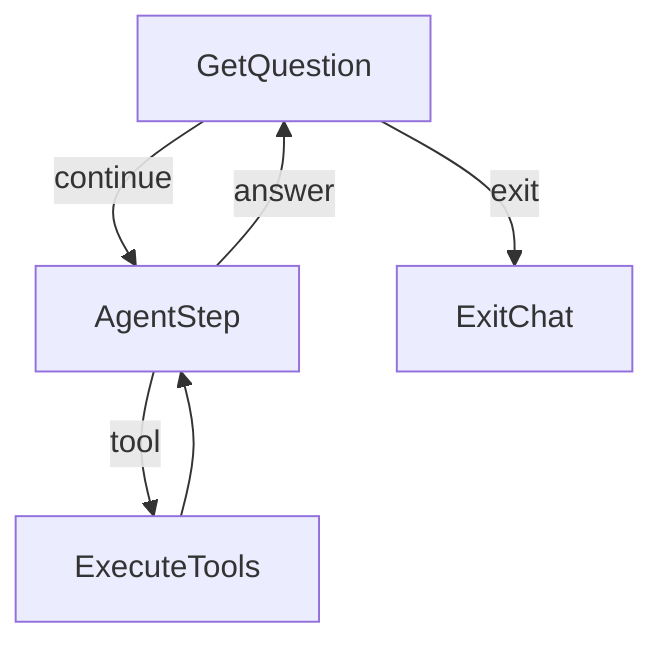
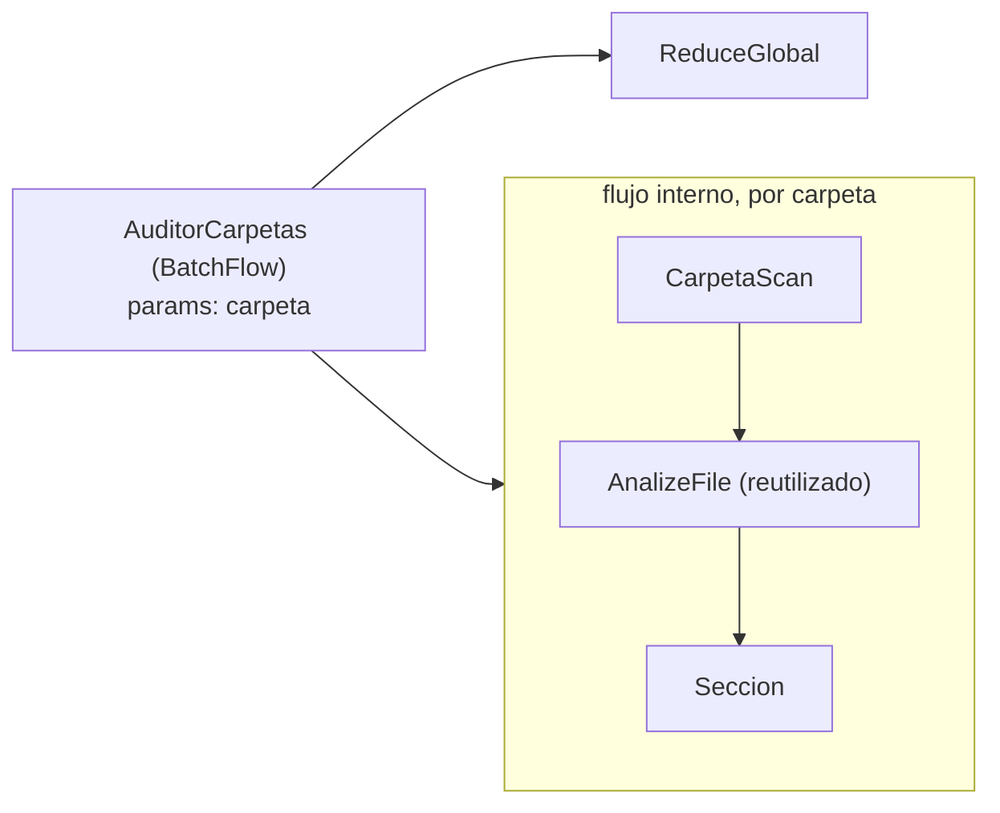
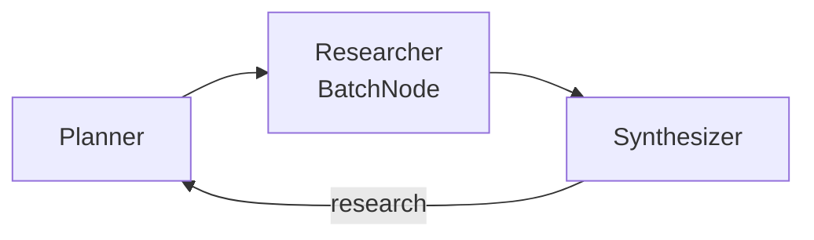
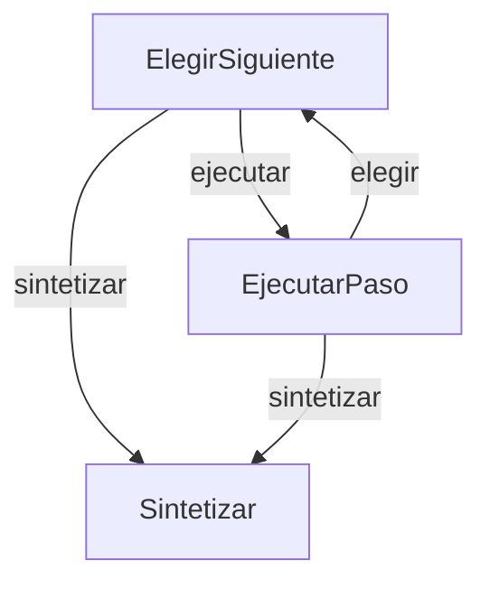

# deepseek-flow — diseño

Agente de terminal con herramientas de lectura de archivos, conectado a
**DeepSeek V4.1 Flash** (`deepseek-flash`, `https://api.deepseek.com`),
armado con PocketFlow.

## Objetivo

Un chat que **no cierra** y que, para responder sobre los archivos del
usuario, los explora por sí mismo: decide cuándo listar y cuándo leer
(patrones Chat + Agent del cookbook). Las credenciales viven **fuera** del
proyecto: `DEEPSEEK_API_KEY` en el entorno o `LLM_API_KEY` en el `.env` de bmo.

## Flujo



Es el patrón Agent (decidir → actuar → volver a decidir) implementado con
**tool calling nativo** de DeepSeek en vez de YAML: `AgentStep` manda el
historial + definiciones de tools; si el modelo responde con `tool_calls`,
la acción `tool` ejecuta y el bucle vuelve a `AgentStep`; si responde con
texto, la acción `answer` imprime y vuelve a esperar la siguiente pregunta.

## Sanitizado de respuestas descarriladas y thinking selectivo

Tres episodios medidos en producción (2026-10-05, todos en el camino
directo): un system prompt ajeno pegado al saludo, un `<small>` que
partía una palabra, una palabra espuria ("¿EnAnswered?"). Dos capas de
respuesta:

1. **Causa raíz (la más probable)**: `call_llm_agent` desactivaba el
   thinking SIEMPRE, aunque la llamada fuera sin tools — y la
   restricción A1 (API rechaza tools+thinking) solo aplica con tools.
   Sin tools ahora va con thinking normal; verificado en vivo: respuestas
   limpias en ambos caminos.
2. **Defensa en profundidad**: `sanitizar()` en `AgentStep.post` corta
   en markers de rol ajenos (`<system>`, `[INST]`…; si no queda nada,
   el reintento del nodo re-pregunta) y quita tags HTML espurios que
   parten palabras (`S<small>oy` → `Soy`), sin tocar markdown legítimo.

## Sanitizado de respuestas descarriladas

Medido en producción (2026-10-05): una respuesta se cortó a mitad del
saludo y el modelo siguió emitiendo un system prompt AJENO (un "file
exploration agent" genérico — texto de entrenamiento, no inyección de
nadie: episodio estocástico de decodificación, no reproducible en 3
intentos). `AgentStep.post` ahora corta el contenido en el primer marker
de rol (`<system>`, `[INST]`, `<|im_start|>`…): el chat muestra y el
historial guarda solo lo que lo precede; si no queda nada, el reintento
del nodo re-pregunta. Test con el transcript real.

## Recuperación del canal de tools (DSML como texto)

Medido en producción (2026-10-05): a veces DeepSeek emite las tool calls
como TEXTO crudo con su markup interno (DSML, `<｜DSML｜｜ invoke …>`) en
vez del canal estructurado — el chat las imprimía como respuesta y se
quedaba esperando, sin ejecutar nada. `AgentStep.post` ahora lo detecta:
sin `tool_calls` pero con la marca DSML en el contenido → `dsml_a_tool_calls`
parsea de vuelta los invokes (misma forma que la API) y los INYECTA en el
mensaje, con el markup limpiado para que el historial quede canónico. El
camino `tool` existente sigue intacto. Test con el transcript real.

## Comunicación (shared)

| Clave | Contenido |
|---|---|
| `messages` | Historial completo: system (fijo) + user + assistant (con `tool_calls` cuando pidió herramientas) + tool (resultados). Es lo único que DeepSeek recibe en cada vuelta |
| `tool_rounds` | Rondas de herramientas gastadas en la pregunta actual; lo resetea `GetQuestion` |

## Nodos

| Nodo | Tipo | prep | exec | post |
|---|---|---|---|---|
| GetQuestion | Node | — | `input()` (ignora vacías; EOF → exit) | `salir/exit/quit` → `exit`; si no, agrega mensaje user, resetea `tool_rounds` → `continue` |
| AgentStep | Node (max_retries=3, wait=5) | historial + tools (sin tools si ya gastó el límite) | `call_llm_agent` | agrega el mensaje del asistente; con `tool_calls` → `tool`; si no, imprime → `answer` |
| ExecuteTools | Node | último `tool_calls` | ejecuta cada llamada (`run_tool_call`) | agrega mensajes tool, suma `tool_rounds` → `default` |
| ExitChat | Node | — | — | imprime despedida |

## Utilities

- `call_llm(messages)` → texto (smoke test).
- `call_llm_agent(messages, tools=None)` → mensaje del asistente, con
  `extra_body={"thinking": {"type": "disabled"}}` porque la API de DeepSeek
  rechaza tools con thinking activo (misma razón que bmo, anotación A1).
- `fs_tools.py` — el cuerpo del agente:
  - `list_files(path?, depth)`: listing con tamaños; sin path lista los
    directorios permitidos; salta `.venv*`, `.git`, `__pycache__`,
    `node_modules`; truncado a 300 entradas.
  - `read_file(path, offset, limit)`: páginas de hasta 500 líneas,
    recortada a `READ_MAX_CHARS` (corta el medio).
  - `search_files(query?, glob?, path?)`: busca por nombre (glob) y/o por
    texto en el contenido (insensible a mayúsculas); devuelve rutas y
    números de línea; topes de 50 archivos / 200 líneas, 5 líneas por
    archivo; omite binarios y archivos de más de 4 MB en búsquedas de
    contenido.
  - `run_tool_call(tc)`: dispatch + mensaje `role=tool`. Los errores de uso
    ("ERROR: ...") se devuelven como texto para que el modelo corrija; los
    fallos transitorios del API los maneja el retry del Node.

## Leyes / límites

| Límite | Qué | Dónde |
|---|---|---|
| Contención | Ninguna ruta sale de `AGENT_ALLOWED_DIRS` (resueltas con `Path.resolve`) | `fs_tools._resolve` |
| Rondas | `MAX_TOOL_ROUNDS` por pregunta; al llegar, `AgentStep` retira las tools y el modelo debe responder | `AgentStep.prep` |
| Contexto | `READ_MAX_CHARS` por lectura, listados truncados | `fs_tools` |

## Segundo flujo: informe map-reduce

```
python3 main.py informe [carpeta] [--glob '*.jsonl'] [--salida informe.md]
```

Default: `~/Documentos/00_IA/bmo/data` (también corre directo con
`python3 informe.py`).


Patrón Map-Reduce del cookbook con **mapa paralelo**: `AnalizeFile` es un
`AsyncParallelBatchNode` (las llamadas a DeepSeek se solapan con
`asyncio.gather`) dentro de un `AsyncFlow`; `ScanFiles` y `WriteReport`
quedan síncronos — `AsyncFlow` ejecuta los `Node` normales tal cual y solo
espera a los `AsyncNode`. La utilidad es `call_llm_async` (`AsyncOpenAI`):
dentro de `gather` tiene que haber I/O esperado de verdad, o nada se
solapa. `asyncio.gather` conserva el orden: el informe es determinista.
Hechos exactos en código, interpretación en LLM (principio de bmo).

Medido: una llamada ≈ 5,5 s; el pipeline completo (12 mapas en paralelo +
1 síntesis secuencial) ≈ 12 s.

| shared | Contenido |
|---|---|
| `folder`, `glob`, `salida` | configuración sembrada por main |
| `files` | rutas encontradas (ScanFiles) |
| `analisis` | `[{file, total, errores, modulos, ejemplos, resumen}]` (AnalizeFile) |
| `informe` | ruta del markdown final (WriteReport) |

Topes: `MAX_FILES=30`, 2 tareas de ejemplo por archivo, reintentos 3/wait 5
en mapa y reduce (el BatchNode reintenta **por archivo**, no por lote).

## Módulos: el CORE y sus capacidades

El chat es el **CORE**: capacidades base de solo lectura (`fs_tools`) más
las herramientas que aporten los módulos. Un módulo es un archivo en
`modules/` que exporta `TOOLS` (esquemas OpenAI) e `IMPL`
(nombre → implementación). `modules.discover()` los junta al arrancar y
`nodes.py` arma el action space: `core + módulos`.

- Agregar una capacidad = dejar un archivo en `modules/`.
- Quitarla = borrarlo (el descubrimiento es al iniciar el proceso).
- Una pieza puede existir standalone y exponerse como módulo:
  `modules/informe.py` es solo el adaptador de `informe.py`, que sigue
  funcionando sola (`main.py informe`).

Es la arquitectura de bmo ("one node, one module, one capability") en su
forma mínima: el action space del agente **es** el registro de módulos.

| Módulo | Herramienta | Qué hace |
|---|---|---|
| `informe` | `run_informe(carpeta?, glob?, salida?)` | lanza el pipeline map-reduce y devuelve la ruta del markdown; el progreso se imprime en vivo |
| `escritura` | `write_file(path, content)` | escribe dentro de los directorios permitidos **con aprobación humana (HITL)**: vista previa (diff si existe) y `s/n` en la terminal; EOF/Ctrl+C cuentan como rechazo (default seguro); el rechazo vuelve al modelo como texto para que corrija; contenido idéntico → no-op |
| `juez` | `answer_verified(pregunta)` | responde con control de calidad: borrador → juez → refinamiento; el juez verifica citas ruta:línea contra el contenido real |
| `auditoria` | `run_auditoria(carpetas, glob?, salida?)` | audita varias carpetas a la vez (una sección por carpeta + síntesis comparativa) |
| `rag` | `rag_search(consulta, k?)` / `rag_index(carpeta?, glob?)` | búsqueda semántica sobre el índice local (embeddings fastembed) y (re)indexación |
| `debate` | `debate(tema, rondas?)` | debate multi-agente (proponente vs crítico por colas) con juez final |
| `mcp` | `mcp_tools()` / `mcp_call(servidor, herramienta, argumentos)` | habla el Model Context Protocol: consume herramientas de servidores MCP externos configurados en `MCP_SERVERS` — el action space deja de ser cerrado |
| `websearch` | `search_web(consulta, k?)` | búsqueda web con ddgs (DuckDuckGo, sin API key); devuelve título, URL y resumen para citar |
| `research` | `deep_research(tema, salida?)` | loop de cobertura: planner → researcher (web) → synthesizer; detecta huecos y re-planifica (MAX_ROUNDS=2) |
| `supervisor` | `run_supervisor(tarea, salida?)` | bucle reactivo: Laya (Choose local, umbral 0.9) o DeepSeek eligen la herramienta de cada paso; síntesis final |
| `db` | `sql(consulta)` / `db_schema()` | SELECT de solo lectura sobre la base SQLite de trazas (una sentencia, LIMIT forzado, sin DDL) |
| `effective_n` | `run_effective_n(carpeta?, glob?, salida?)` | deduplicación exacta por contenido de trazas .jsonl: Effective N, archivos duplicados enteros, solape por pares, contradicciones de etiqueta |

### Servidor MCP (dirección inversa)

`python3 main.py mcp-server` expone las capacidades del chat a OTROS
agentes por stdio ([mcp_server.py](../mcp_server.py)). Allowlist en
`MCP_EXPOSE` (default: solo lectura + rag + juez; excluye write_file por
el HITL de terminal y los pipelines largos). En stdout viaja el protocolo:
todo aviso del servidor va a stderr.

## Piezas: juez, auditoría, RAG y debate

Cada pieza es standalone (subcomando CLI) Y módulo del chat.

### Juez — evaluator-optimizer + structured output
`main.py juez "pregunta"` · [juez.py](../juez.py)


`Draft` recibe en prep el contenido real de los archivos mencionados en
la pregunta (los hechos los reúne el código). `Judge` extrae las citas
`ruta:línea` del borrador, lee las líneas reales, y evalúa en YAML
(`verdict: ok/retry`) — `extraer_yaml` + asserts: un YAML roto lanza y el
retry del Node re-pregunta. Tope de `JUEZ_ROUNDS` (ley L8).

### Auditoría — BatchFlow + flujo anidado (Flow como Node)
`main.py auditoria c1 c2 [--glob] [--salida]` · [auditoria.py](../auditoria.py)



El `AsyncBatchFlow` re-corre el flujo interno una vez por carpeta con
`params["carpeta"]` (el identificador viaja en params, los datos en
shared), y el BatchFlow mismo se enchufa como nodo en el Flow exterior
antes del reduce. Iteraciones secuenciales a propósito: comparten shared.

### RAG — offline index + online retrieve
`main.py index [carpeta] [--glob]` · [rag.py](../rag.py) · [utils/embeddings.py](../utils/embeddings.py)

Offline: `ChunkDocs → EmbedChunks → SaveIndex` (BatchNodes; chunks de
1200 chars con overlap, embeddings fastembed locales — paraphrase-
multilingual-MiniLM, sin API key — guardados en `rag_index/`). Online:
`buscar(consulta)` encasta por coseno y devuelve top-k con ruta y score.
Sin embedder disponible degrada a BM25 léxico (mismo flujo, otro scorer).
El modo viaja por `flow.set_params` — params para config de tarea.

### Debate — multi-agente con colas`main.py debate "tema" [--rondas]` · [debate.py](../debate.py)

Proponente y Crítico son dos `AsyncFlow` independientes que se
auto-apuntan (`agente - "continue" >> agente`) y se comunican SOLO por
`asyncio.Queue` (patrón Taboo del doc de multi-agent). Sentinel `FIN`
para terminar limpio; `JuezDebate` dictamina en YAML reutilizando
`extraer_yaml`. Las call_llm síncronas dentro de async son correctas:
el debate es ping-pong, solo uno piensa a la vez.

### Research — loop de cobertura (la inversión del juez)
`main.py research "tema"` · [research.py](../research.py)



El synthesizer juzga la COBERTURA (no la respuesta): con huecos, vuelve
al planner con feedback; presupuesto MAX_ROUNDS=2. Web por ddgs,
structured output en todo (extraer_yaml + assert + retry).

### Supervisor — bucle reactivo con Choose local
`main.py supervisor "tarea"` · [supervisor.py](../supervisor.py) · [sonda_supervisor.py](../sonda_supervisor.py)



ElegirSiguiente (Laya con la task **supervisor_dispatch**: 18 opciones =
17 tools + finish; `uncertain` o sin laya → DeepSeek con el catálogo) →
EjecutarPaso (args por mini-llamada DeepSeek + ejecución + el hecho
`N herramienta(args) -> resultado` que verá la elección siguiente) →
repetir hasta finish o MAX_PASOS=5 (L8) → Sintetizar. Antes era una
tanda: un plan de una vez y los pasos dependientes quedaban fuera; ahora
el paso N+1 decide con el resultado del N — el Choose de bmo. El estado
`{tarea, hechos}` y `PREGUNTA_DESPACHO` replican la task byte a byte
(test de humo vigila las 18 opciones). Anti-recursión (L1): run_supervisor
no está entre las opciones ni en el fallback. **Mayoría 2-de-3**
(`utils/votacion.py`): la vía dudosa resuelve por mayoría — voto A
(DeepSeek, prompt clásico), voto B (DeepSeek, por eliminación: framing
independiente) y voto C (el crudo de Laya, consulta ya pagada); triple
desacuerdo → gana A. Laya segura sigue despachando sola (0 llamadas); el
veto manda sobre cualquier mayoría. USE_VOTACION=0 apaga (voto único).
Medido con LLM real sobre el test de 24: sistema 16/24 (voto único) →
**17/24 (mayoría)**; corrige justo los pares confusos (search_web↔list,
db_schema↔sql, read_file↔search_web) y el hallazgo honesto: A y B
correlacionan (misma familia ante el mismo catálogo, coincidieron
equivocados en 3 casos) — la independencia real la aporta el voto C. **Self-healing** (ítem 4
del roadmap): un paso que falla es un hecho con `ERROR (...)`; reintentar
esa herramienta recibe el error como feedback explícito en el prompt de
args; a los {MAX_FALLOS_POR_HERRAMIENTA} fallos la herramienta se VETA
(ni Laya ni DeepSeek pueden elegirla; si DeepSeek desobedece, finish) —
el reintento tiene presupuesto, no bucle. El éxito limpia el contador.
El informe final lleva la sección "Pasos": la auditoría de la corrida
(una línea por paso con su resultado, errores incluidos). Verificado con LLM real en cuatro
corridas (íntegras en el log de la sesión): (1-2) tareas limpias —
trazas de bmo/data y localizar MAX_TOOL_ROUNDS — sin fallos duros, con
recuperación suave (truncado → relectura acotada); (3) archivo
inexistente: fallo → pivot ordenado (search→list→search) → cierre
honesto con alternativa; (4) SQL con columna inexistente: fallo →
reintento con feedback → corrección copiando el nombre exacto del
esquema ya ejecutado → tarea resuelta. La corrida (4) destapó dos fixes:
- **Veto de repetición sin-args**: db_schema corrió 4 veces en la primera
  versión de la tarea (patología medida — el presupuesto se quemaba antes
  del primer error). Las herramientas sin argumentos que ya corrieron
  exitosas quedan vetadas en la corrida (L8; `SIN_ARGS`).
- **Feedback reforzado**: el reintento corregía a ciegas ("programa") en
  vez de leer el esquema visible en hechos; ahora el prompt exige copiar
  los nombres EXACTOS de los pasos ejecutados. El umbral de despacho es
propio y MÁS exigente que el del router (`LAYA_UNSURE_HIGH_SUPERVISOR`,
0.9): un paso quemado pesa más que la llamada que ahorra. utils/laya
cachea agentes POR setting: el router y el supervisor son checkpoints
distintos (`LAYA_MODEL` / `LAYA_MODEL_SUPERVISOR`).

Ciclo de fine-tune medido (test a mano 24, todas las opciones cubiertas):

| checkpoint | crudo | ECE | despachos locales (umbral 0.9) |
|---|---|---|---|
| base multilingual | 5/24 | 0.574 | — |
| supervisor_dispatch r1 | 8/24 | 0.353 | (menú truncado) |
| supervisor_dispatch r2 (60/opción) | 11/24 | 0.222 | 1/24 · 1/1 |
| supervisor_dispatch r3 (164/opción, hechos 100% del menú) | 15/24 | 0.293 | 13/24 · 9/13 |
| **r4 (+round dirigido a los pares confusos, 3.283 casos)** | 14/24 | 0.238 | **8/24 · 8/8 correctos** |

Hallazgos del ciclo (todos documentados en el LEEME de
bmo/train/kaggle-supervisor): (1) **el head se trunca en silencio** —
instructions + 18 criteria ≈ 278 tokens > head_max_len 256: las últimas
opciones nunca se veían; criteria cortos → 231 tokens y +3 de acierto;
(2) **el 87% del dataset entrenó con hechos de herramientas inventadas**
(grep, ls, python...) porque el prompt no restringía los nombres — el
filtro exacto (`train/filtrar_hechos.py`) rescató 138/1.094; el prompt
corregido exige nombres del menú y 1/3 de primer paso (train viejo 12%
vs test 54%); (3) la dosis por opción manda: router 410/opción → 20/24,
harness_choose 330 → 23/24, esto 60 → 11/24; (4) la generación del
round a escala (n=216) murió con HTTP 402 (saldo DeepSeek agotado) tras
399 casos casi todos primer-paso — inservibles. El checkpoint v2 está
el round a escala se corrió tras recargar saldo: 2.946 casos (89-215 por
opción, hechos 100% del menú real) → 15/24 con 13 despachos locales de
los cuales 9 correctos. Tercera corrección del ciclo: el propio filtro
de hechos tenía un bug (findall con dos grupos → tuplas → rechazaba
todo); medición real del dataset viejo: 33% válido, y el prompt
corregido da 100%. Umbral 0.9 mantenido con números. El round dirigido a los pares
confusos (+560 verificados con generate_targeted, reescrito genérico)
curó lo que quedaba: r4 despacha MENOS (8/24) pero 8/8 correctos — el
modelo aprendió a dudar donde antes estaba seguro y equivocado. El
acierto crudo se estanca en ~14-15/24 (el matiz de los pares
search_web/deep_research, informe/auditoria, sql/db_schema es en parte
convención, no hecho); la calibración es lo que el sistema necesita:
todo lo que Laya despacha local es correcto, el resto lo decide DeepSeek.
Techo asumido: más rounds de datos no mueven el crudo.

### Base de datos — trazas interrogables
`python3 carga_trazas.py [carpeta]` → `trazas.db` · [modules/db.py](../modules/db.py)

Carga código-pura verificable (15.595 registros, cruza con los conteos
del informe); la tool `sql` es SELECT de una sola sentencia con LIMIT
forzado y vocabulario prohibido (insert/update/delete/...).

### Effective N — deduplicación exacta antes de entrenar
`main.py effective_n [carpeta]` · [effective_n.py](../effective_n.py)


El informe cuenta registros por archivo; esta pieza responde la pregunta
previa al re-entrenamiento: cuántos son **distintos de verdad**. Código
puro (como carga_trazas), sin LLM: la huella de contenido es sha1 de
`(task, observation, criteria, steps, answers.next)` — ignora
`id`/`created`/`model`, que cambian entre volcados del mismo caso. El mapa
hashea archivo por archivo; el reduce cruza pares, detecta archivos
duplicados enteros (md5), contradicciones de etiqueta (misma huella sin
`next`, etiquetas distintas) y escribe el markdown.

| shared | Contenido |
|---|---|
| `folder`, `glob`, `salida` | configuración sembrada por main |
| `files` | rutas encontradas (ScanFiles) |
| `analisis` | por archivo: n, rotos, huellas, etiquetas, con steps/observation, dist next, md5 |
| `informe`, `resumen` | ruta del markdown y línea "N → Effective N" (WriteReport) |

Hallazgos medidos sobre `bmo/data` (12 archivos, 15.595 registros):

1. **Effective N = 6.717** (56,9% de duplicación), **0 contradicciones de
   etiqueta** — la duplicación es repetición, no ruido de etiquetas.
2. `round3/harness_choose.jsonl` ≡ `round3/harness_choose_verified.jsonl`
   **byte a byte (md5 idéntico)**: la verificación de round3 no filtró
   nada — el volcado copió choose→verified sin pasar por el juez.
3. round3 es **acumulativo**: contiene 2.316 de los 2.591 de round2
   (89,6%). Sumar round2+round3 casi no suma datos (aporta 275 casos).
4. **Rounds sin `steps`**: round1-3 traen `observation` (0 registros con
   `steps`); producción (decisions.jsonl del sandbox: 121/151) y la raíz
   verified (1.097/1.109) usan `steps`. Esquema de estado distinto: si se
   re-entrena con rounds, el modelo no ve el campo que domina en producción.
5. `relabelled` vacío (0 bytes) en raíz y round1: el volcado lo crea y
   nunca lo llena. La raíz `rejected` mezcla dos esquemas (60 con steps +
   354 con observation).
6. Subconjunto entrenable máximo no redundante:
   `raiz_verified + round1_verified + round3` = **6.141 casos** (los tres
   bloques son disjuntos por contenido entre sí).

Decisión sobre el pipeline de rounds (el ítem 1 del roadmap): el volcado
de rounds no está versionado en bmo (ningún script del repo escribe
`*_verified`/`*_relabelled`) y dejó tres defectos: verificación saltada
(round3), esquema sin `steps`, relabelled nunca poblado. Corrección:
regenerar los rounds con el generador versionado (`train/generate_targeted.py`,
que emite `steps` vía schema) o versionar el generador de observaciones;
hasta entonces, entrenar solo con el subconjunto del punto 6 y tratar
`round3/verified` como choose.

### Laya — el router del chat, afinado (activo por defecto)
[utils/laya.py](../utils/laya.py) · nodos LayaRouter/DirectAnswer · [sonda_router.py](../sonda_router.py)

Laya responde preguntas cerradas en local (carga ~12 s, inferencia ~0 s,
costo 0) con probabilidades; los umbrales de bmo (0.7/0.3) convierten la
confianza en met/uncertain/not met, y uncertain cae al lado SEGURO
(herramientas). El checkpoint es el fine-tune **router_flow** (bmo,
`train/kaggle-router/`): la task replica byte a byte `PREGUNTA_ROUTER` y
el estado `{"pregunta": ...}` es el mismo dict que produce
`Task.state` — el contrato entrenamiento≡producción que las rondas 4 de
harness_choose enseñaron por las malas (estado distinto → 14/24).

Pipeline (la stack de bmo tal cual): task YAML + 12 contextos de tráfico
→ generate con DeepSeek (json_object; 840 casos balanceados, únicos) →
verify con juez ciego (821/840 conservados) → Kaggle T4 (`layaft train`,
RLCD + calibración, 656 secuencias, median 93 tokens) → checkpoint
`.modelos/router_flow-1k` → medición local en CPU.

Medido sobre el test a mano de 24 (12/12, jamás entrenado; los 5 primeros
son la sonda histórica):

| checkpoint | crudo | ECE | con compuerta |
|---|---|---|---|
| base multilingual | 13/24 | 0.379 | 12/24 |
| router_flow-1k | 20/24 | 0.077 | 22/24 |
| **router_flow-1k curado (test 30, +300 imperativos)** | **27/30** | **0.066** | **28/30** |

El fallo del base era sistemático: sesgo a `directo` con confianza ALTA
(mundial 0.95, cómputo 0.97, clima 0.97, README 0.84) — la compuerta no
protegía porque los errores eran seguros de sí (de 12 casos-herramientas
acertaba 2). Tras el fine-tune la compuerta vuelve a servir: los errores
crudos quedan en confianzas bajas (clima 0.68, README 0.51, tests 0.57)
y caen al lado seguro. Los 2 fallos restantes: "¿quién ganó el último
mundial?" (directo 0.83, pasa la compuerta — el punto débil histórico
persiste en su forma española neutra) y el muro de Berlín (directo
correcto pero 0.63 < 0.7 → herramientas; sobre-cautela barata: cuesta
una llamada más, no una respuesta mal fundada).

`sonda_router.py` corre el test con la lógica EXACTA de producción
(`python3 sonda_router.py [ckpt ...]`, sin args usa `LAYA_MODEL`).
**Curaduría con imperativos** (2026-10-05): la sesión completa mostró
el falso-directo sistemático con imperativos de acción ("debatí…",
"investigá…", 0.78-0.96). Round dirigido de +300 casos con la regla
capacidad-vs-creativo en el prompt (generate_targeted, 300/300
verificados → 1.121 casos) y un run más: los 6 casos-imperativos del
test 6/6, y la trampa inversa ("escribime un haiku") correcta a 0.97.
Persiste el histórico "último mundial" (0.83) — en producción lo cubre
el voto. **Ensamble 2-de-2 con voto de confirmación** (medido en la sesión
completa): el checkpoint dice 'directo' con confianza 0.78-0.96 para
imperativos de acción ("debatí…", "investigá…") y las capacidades se
perdían — el test del router no tenía casos imperativos. Ahora, cuando
Laya dice directo con 'met', `voto_confirmacion_router` pide una
mini-llamada de confirmación a DeepSeek ("¿herramientas o directo?");
desacuerdo → lado seguro. Verificado en vivo: debate y deep_research
corrieron por fin como tools (planner, búsqueda, huecos, segunda ronda).
Cobertura final: **18/18 capacidades**. USE_VOTACION=0 apaga ambos
ensambles.

Verificado el flujo COMPLETO del chat contra LLM real (2026-10-05):
camino directo dos vueltas seguidas y camino herramientas con tool_calls
reales. La primera pasada destapó un bug de cableado latente desde el
flag-0: `DirectAnswer >> ask` armaba la arista default pero el post
heredado devuelve "answer" — el chat MORÍA tras la primera respuesta
directa (PocketFlow: "Flow ends: 'answer' not found"). Fix: aristas
`answer`/`tool` explícitas (test_router_aristas_del_chat lo vigila).

Hallazgos medidos: (1) el downloader de huggingface_hub cuelga en este
entorno aunque el CDN dé 32 MB/s — el checkpoint base se bajó con curl a
`.modelos/laya-multilingual` y `LAYA_MODEL` apunta ahí; (2) con path
local hay que setear `HF_HUB_OFFLINE` ANTES de `import laya`
(huggingface_hub lee las variables al importarse); (3) el fine-tune de
bmo (harness_choose) responde casi al azar (0.52/0.48) fuera de su
distribución — cada fine-tune sirve a SU pregunta; (4) la confianza útil
es `answer_confidence`, no `confidence`; (5) el lock de inferencia debe
ser RLock (preguntar → agente re-entra); (6) el generador de datos
escribe por combo y ~30% de los casos venían con etiqueta que no
ejemplificaban — la regla "the labeled answer must be the only
defensible one" en el prompt de la task + verify lo dejaron en 2,3%
(19/840); (7) los kernels de Kaggle montan los datasets en
`/kaggle/input/datasets/<owner>/<slug>`, no en `/kaggle/input/<slug>`:
resolver el base buscando `model.safetensors`, no por nombre.

## Cómo crecer desde aquí

- Escribir archivos → herramienta write_file con confirmación humana
  previa (HITL).
- Memoria entre sesiones → persistir `messages` (cookbook `chat-memory`).
- Muchos documentos y preguntas repetidas → indexar offline (RAG).
- Streaming de respuestas y memoria entre sesiones (persistir/comprimir
  `messages`).
- Choose del supervisor a escala: recargar saldo DeepSeek, generar
  ~2.400 casos con hechos del menú real (prompt ya corregido), verify
  y un run más — la dosis por opción es la palanca que falta (60 → 120+).
- Datar el punto débil restante del router (mundial): un round dirigido
  de "hechos actuales" con `generate_targeted` (arreglar su
  `contexts_path` roto primero).
- La aprobación HITL vive hoy dentro del tool (`input()`); si el chat
  migra a web (FastAPI/Gradio), subirla a una arista del grafo
  (`needs_approval` → AskHuman → `approved/rejected`).
- Self-healing batch (pasos fallidos re-encolados con feedback) y
  heartbeat (piezas corriendo solas de noche).
- Un visor del trace (.runs/*.jsonl ya registra nodo/acción/duración).

### Heartbeat — las piezas de noche
`python3 main.py heartbeat [--ahora|--seco]` · [heartbeat.py](../heartbeat.py) · [heartbeat.jsonl](../heartbeat.jsonl)

Pieza standalone: lee las tareas de `heartbeat.jsonl` (tarea + salida +
`cada_horas`), corre las vencidas con el supervisor reactivo completo y
deja informe + estado (`.heartbeat/estado.json`) + log de auditoría
(`.heartbeat/log.jsonl`). El reloj lo pone el cron del sistema
(la línea sugerida vive en el docstring); la pieza solo decide qué toca —
sin tareas vencidas no gasta una llamada. `--ahora` fuerza (para probar),
`--seco` lista. Leyes: cada tarea es un supervisor entero (MAX_PASOS=5,
veto tras dos fallos) y MAX_TAREAS_POR_CORRIDA=10. Crea el directorio de
salida (lección de la primera corrida: Sintetizar escribe directo).

### Visor del trace — los .runs abiertos
`python3 main.py visor [trace.jsonl ...]` · [visor.py](../visor.py)

Pieza standalone de código puro: lee los eventos de `.runs/*.jsonl`
(`{ts, nodo, accion, seg}` — utils/tracing) y escribe al lado un HTML
autocontenido (offline, sin CDN): el recorrido con las vueltas del bucle
(la historia `ElegirSiguiente→EjecutarPaso` del supervisor se lee de un
vistazo), el resumen por nodo (veces, tiempo, %) y la cronología con
barras de duración proporcionales. Sin args usa el trace con contenido
más reciente (main.py abre el propio antes de despachar: los vacíos se
saltan). Determinista: el mismo jsonl da el mismo HTML (test de humo).

## Sesión de prueba completa (2026-10-05): 19 turnos, las 18 capacidades

Una sola sesión continua de chat ejerciendo todo el harness. Resultado
por capacidad: router directo ✓, list/read/search ✓, write_file con HITL
(crea y sobrescribe) ✓, answer_verified con citas ✓, sql ✓, mcp_tools +
mcp_call (1847×293=541171, correcto) ✓, search_web (honesto: los snippets
no traían el tag de versión) ✓, rag_index + rag_search (35 fragmentos,
dedup en design.md al top) ✓, run_effective_n ✓, run_informe (22
archivos, 33.974 registros — creció con los datasets nuevos) ✓,
run_auditoria (round1 vs round3) ✓, run_supervisor (42 .py, el más
grande correcto, notó hasta el path truncado en los hechos) ✓,
debate/research ✗ (ver hallazgo 1).

Hallazgos y sus fixes:

1. **El separador DSML es DOBLE barra** (`<｜｜DSML｜｜`): la primera
   versión de la recuperación usaba una sola (copiada de un transcript
   pegado a mano que la colapsaba) y NUNCA disparó — el debate y el
   research de la sesión se perdieron. Fix: regex flexible `[｜|]{1,2}`,
   verificada contra los tres bloques reales del log (los tres parsean)
   y con test de ambos formatos. El patrón de fondo: el DSML aparece
   cuando el modelo va SIN tools (camino directo del router) pero quiere
   llamar igual — tres de los falso-directo del router terminaron en
   DSML; con la recuperación andando, ese error del router se
   auto-corrige.
2. **Repetición idéntica con args en el supervisor**: search_files con
   el mismo glob corrió 4 veces (el veto solo cubría sin-args). Fix:
   firma canónica herramienta+args → cache (la idéntica no re-ejecuta,
   reutiliza el resultado) + veto a la segunda firma repetida.
3. Ruido cosmético: httpx/asyncio "Event loop is closed" al cerrar los
   clientes async (×6 por sesión) — sin impacto, pendiente de silenciar.
   Warning de fastembed (mean pooling) — informativo, sin acción.
4. El falso-directo del router se confirmó en vivo dos veces más
   (MCP 0.82, debate 0.78) — candidato al ensamble 2-de-3 cuando toque.

## Salidas — una carpeta, no una raíz llena de .md

Higienizado (2026-10-05): todas las piezas escribían sus informes en la
raíz del proyecto (informe.md, auditoria*.md, supervisor*.md,
research*.md, effective_n*.md...) — el .gitignore los tapaba de git pero
no del disco. Ahora el default de TODAS las salidas es `salidas/` (y
`salidas/heartbeat/` para las nocturnas), cada escritor crea su
directorio (la lección del heartbeat), y el .gitignore se simplificó a
`salidas/` única.

## El CWD en el system prompt

Medido en producción (2026-10-05): "¿en qué carpeta estamos?" se
respondía con la raíz permitida (el único directorio que el modelo
conocía) en vez del CWD real. El system prompt ahora declara el
directorio de trabajo actual del proceso: la pregunta sobre el entorno
se responde con el dato, sin adivinar ni gastar tools.
