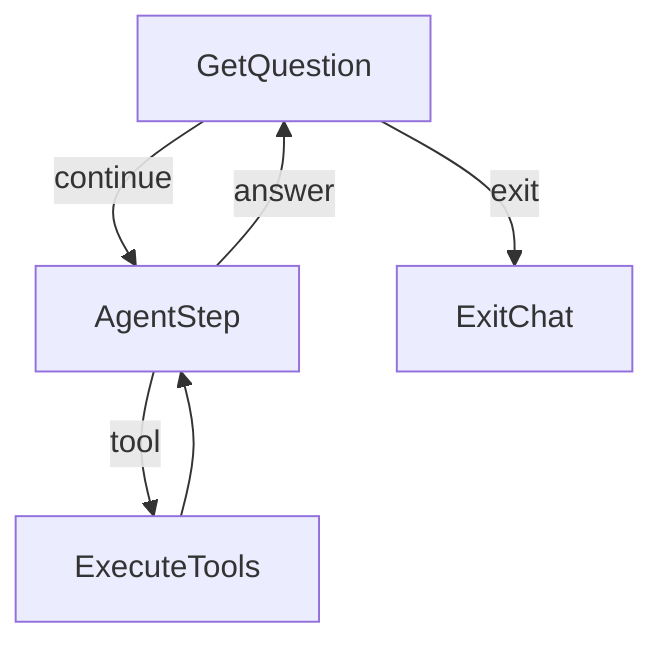
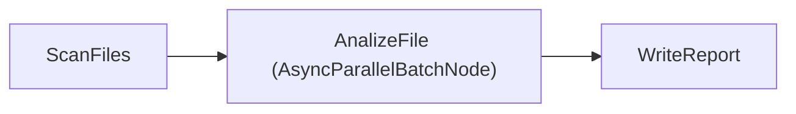
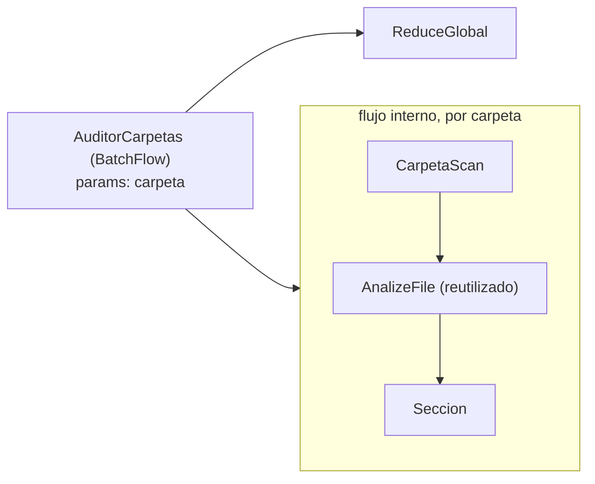
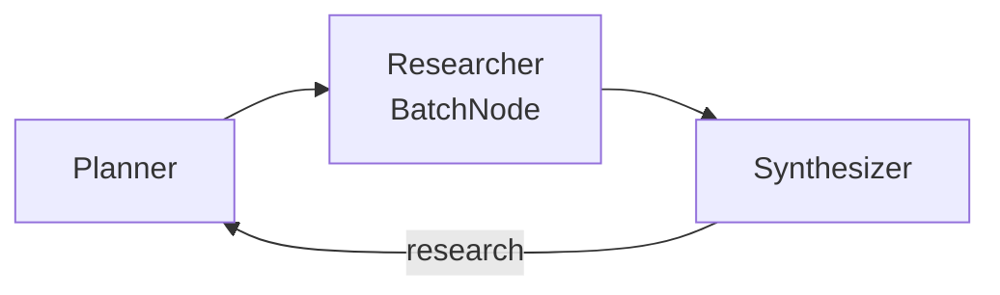

# deepseek-flow — diseño

Agente de terminal con herramientas de lectura de archivos, conectado a
**DeepSeek V4.1 Flash** (`deepseek-flash`, `https://api.deepseek.com`),
armado con PocketFlow.

## Objetivo

Un chat que **no cierra** y que, para responder sobre los archivos del
usuario, los explora por sí mismo: decide cuándo listar y cuándo leer
(patrones Chat + Agent del cookbook). Las credenciales viven **fuera** del
proyecto: `DEEPSEEK_API_KEY` en el entorno o `LLM_API_KEY` en el `.env` de bmo.

## Flujo



Es el patrón Agent (decidir → actuar → volver a decidir) implementado con
**tool calling nativo** de DeepSeek en vez de YAML: `AgentStep` manda el
historial + definiciones de tools; si el modelo responde con `tool_calls`,
la acción `tool` ejecuta y el bucle vuelve a `AgentStep`; si responde con
texto, la acción `answer` imprime y vuelve a esperar la siguiente pregunta.

## Comunicación (shared)

| Clave | Contenido |
|---|---|
| `messages` | Historial completo: system (fijo) + user + assistant (con `tool_calls` cuando pidió herramientas) + tool (resultados). Es lo único que DeepSeek recibe en cada vuelta |
| `tool_rounds` | Rondas de herramientas gastadas en la pregunta actual; lo resetea `GetQuestion` |

## Nodos

| Nodo | Tipo | prep | exec | post |
|---|---|---|---|---|
| GetQuestion | Node | — | `input()` (ignora vacías; EOF → exit) | `salir/exit/quit` → `exit`; si no, agrega mensaje user, resetea `tool_rounds` → `continue` |
| AgentStep | Node (max_retries=3, wait=5) | historial + tools (sin tools si ya gastó el límite) | `call_llm_agent` | agrega el mensaje del asistente; con `tool_calls` → `tool`; si no, imprime → `answer` |
| ExecuteTools | Node | último `tool_calls` | ejecuta cada llamada (`run_tool_call`) | agrega mensajes tool, suma `tool_rounds` → `default` |
| ExitChat | Node | — | — | imprime despedida |

## Utilities

- `call_llm(messages)` → texto (smoke test).
- `call_llm_agent(messages, tools=None)` → mensaje del asistente, con
  `extra_body={"thinking": {"type": "disabled"}}` porque la API de DeepSeek
  rechaza tools con thinking activo (misma razón que bmo, anotación A1).
- `fs_tools.py` — el cuerpo del agente:
  - `list_files(path?, depth)`: listing con tamaños; sin path lista los
    directorios permitidos; salta `.venv*`, `.git`, `__pycache__`,
    `node_modules`; truncado a 300 entradas.
  - `read_file(path, offset, limit)`: páginas de hasta 500 líneas,
    recortada a `READ_MAX_CHARS` (corta el medio).
  - `search_files(query?, glob?, path?)`: busca por nombre (glob) y/o por
    texto en el contenido (insensible a mayúsculas); devuelve rutas y
    números de línea; topes de 50 archivos / 200 líneas, 5 líneas por
    archivo; omite binarios y archivos de más de 4 MB en búsquedas de
    contenido.
  - `run_tool_call(tc)`: dispatch + mensaje `role=tool`. Los errores de uso
    ("ERROR: ...") se devuelven como texto para que el modelo corrija; los
    fallos transitorios del API los maneja el retry del Node.

## Leyes / límites

| Límite | Qué | Dónde |
|---|---|---|
| Contención | Ninguna ruta sale de `AGENT_ALLOWED_DIRS` (resueltas con `Path.resolve`) | `fs_tools._resolve` |
| Rondas | `MAX_TOOL_ROUNDS` por pregunta; al llegar, `AgentStep` retira las tools y el modelo debe responder | `AgentStep.prep` |
| Contexto | `READ_MAX_CHARS` por lectura, listados truncados | `fs_tools` |

## Segundo flujo: informe map-reduce

```
python3 main.py informe [carpeta] [--glob '*.jsonl'] [--salida informe.md]
```

Default: `~/Documentos/00_IA/bmo/data` (también corre directo con
`python3 informe.py`).



Patrón Map-Reduce del cookbook con **mapa paralelo**: `AnalizeFile` es un
`AsyncParallelBatchNode` (las llamadas a DeepSeek se solapan con
`asyncio.gather`) dentro de un `AsyncFlow`; `ScanFiles` y `WriteReport`
quedan síncronos — `AsyncFlow` ejecuta los `Node` normales tal cual y solo
espera a los `AsyncNode`. La utilidad es `call_llm_async` (`AsyncOpenAI`):
dentro de `gather` tiene que haber I/O esperado de verdad, o nada se
solapa. `asyncio.gather` conserva el orden: el informe es determinista.
Hechos exactos en código, interpretación en LLM (principio de bmo).

Medido: una llamada ≈ 5,5 s; el pipeline completo (12 mapas en paralelo +
1 síntesis secuencial) ≈ 12 s.

| shared | Contenido |
|---|---|
| `folder`, `glob`, `salida` | configuración sembrada por main |
| `files` | rutas encontradas (ScanFiles) |
| `analisis` | `[{file, total, errores, modulos, ejemplos, resumen}]` (AnalizeFile) |
| `informe` | ruta del markdown final (WriteReport) |

Topes: `MAX_FILES=30`, 2 tareas de ejemplo por archivo, reintentos 3/wait 5
en mapa y reduce (el BatchNode reintenta **por archivo**, no por lote).

## Módulos: el CORE y sus capacidades

El chat es el **CORE**: capacidades base de solo lectura (`fs_tools`) más
las herramientas que aporten los módulos. Un módulo es un archivo en
`modules/` que exporta `TOOLS` (esquemas OpenAI) e `IMPL`
(nombre → implementación). `modules.discover()` los junta al arrancar y
`nodes.py` arma el action space: `core + módulos`.

- Agregar una capacidad = dejar un archivo en `modules/`.
- Quitarla = borrarlo (el descubrimiento es al iniciar el proceso).
- Una pieza puede existir standalone y exponerse como módulo:
  `modules/informe.py` es solo el adaptador de `informe.py`, que sigue
  funcionando sola (`main.py informe`).

Es la arquitectura de bmo ("one node, one module, one capability") en su
forma mínima: el action space del agente **es** el registro de módulos.

| Módulo | Herramienta | Qué hace |
|---|---|---|
| `informe` | `run_informe(carpeta?, glob?, salida?)` | lanza el pipeline map-reduce y devuelve la ruta del markdown; el progreso se imprime en vivo |
| `escritura` | `write_file(path, content)` | escribe dentro de los directorios permitidos **con aprobación humana (HITL)**: vista previa (diff si existe) y `s/n` en la terminal; EOF/Ctrl+C cuentan como rechazo (default seguro); el rechazo vuelve al modelo como texto para que corrija; contenido idéntico → no-op |
| `juez` | `answer_verified(pregunta)` | responde con control de calidad: borrador → juez → refinamiento; el juez verifica citas ruta:línea contra el contenido real |
| `auditoria` | `run_auditoria(carpetas, glob?, salida?)` | audita varias carpetas a la vez (una sección por carpeta + síntesis comparativa) |
| `rag` | `rag_search(consulta, k?)` / `rag_index(carpeta?, glob?)` | búsqueda semántica sobre el índice local (embeddings fastembed) y (re)indexación |
| `debate` | `debate(tema, rondas?)` | debate multi-agente (proponente vs crítico por colas) con juez final |
| `mcp` | `mcp_tools()` / `mcp_call(servidor, herramienta, argumentos)` | habla el Model Context Protocol: consume herramientas de servidores MCP externos configurados en `MCP_SERVERS` — el action space deja de ser cerrado |
| `websearch` | `search_web(consulta, k?)` | búsqueda web con ddgs (DuckDuckGo, sin API key); devuelve título, URL y resumen para citar |
| `research` | `deep_research(tema, salida?)` | loop de cobertura: planner → researcher (web) → synthesizer; detecta huecos y re-planifica (MAX_ROUNDS=2) |
| `supervisor` | `run_supervisor(tarea, salida?)` | descompone una tarea compuesta (YAML+assert) y ejecuta cada paso con el action space completo; síntesis final |
| `db` | `sql(consulta)` / `db_schema()` | SELECT de solo lectura sobre la base SQLite de trazas (una sentencia, LIMIT forzado, sin DDL) |

### Servidor MCP (dirección inversa)

`python3 main.py mcp-server` expone las capacidades del chat a OTROS
agentes por stdio ([mcp_server.py](../mcp_server.py)). Allowlist en
`MCP_EXPOSE` (default: solo lectura + rag + juez; excluye write_file por
el HITL de terminal y los pipelines largos). En stdout viaja el protocolo:
todo aviso del servidor va a stderr.

## Piezas: juez, auditoría, RAG y debate

Cada pieza es standalone (subcomando CLI) Y módulo del chat.

### Juez — evaluator-optimizer + structured output
`main.py juez "pregunta"` · [juez.py](../juez.py)


`Draft` recibe en prep el contenido real de los archivos mencionados en
la pregunta (los hechos los reúne el código). `Judge` extrae las citas
`ruta:línea` del borrador, lee las líneas reales, y evalúa en YAML
(`verdict: ok/retry`) — `extraer_yaml` + asserts: un YAML roto lanza y el
retry del Node re-pregunta. Tope de `JUEZ_ROUNDS` (ley L8).

### Auditoría — BatchFlow + flujo anidado (Flow como Node)
`main.py auditoria c1 c2 [--glob] [--salida]` · [auditoria.py](../auditoria.py)



El `AsyncBatchFlow` re-corre el flujo interno una vez por carpeta con
`params["carpeta"]` (el identificador viaja en params, los datos en
shared), y el BatchFlow mismo se enchufa como nodo en el Flow exterior
antes del reduce. Iteraciones secuenciales a propósito: comparten shared.

### RAG — offline index + online retrieve
`main.py index [carpeta] [--glob]` · [rag.py](../rag.py) · [utils/embeddings.py](../utils/embeddings.py)

Offline: `ChunkDocs → EmbedChunks → SaveIndex` (BatchNodes; chunks de
1200 chars con overlap, embeddings fastembed locales — paraphrase-
multilingual-MiniLM, sin API key — guardados en `rag_index/`). Online:
`buscar(consulta)` encasta por coseno y devuelve top-k con ruta y score.
Sin embedder disponible degrada a BM25 léxico (mismo flujo, otro scorer).
El modo viaja por `flow.set_params` — params para config de tarea.

### Debate — multi-agente con colas`main.py debate "tema" [--rondas]` · [debate.py](../debate.py)

Proponente y Crítico son dos `AsyncFlow` independientes que se
auto-apuntan (`agente - "continue" >> agente`) y se comunican SOLO por
`asyncio.Queue` (patrón Taboo del doc de multi-agent). Sentinel `FIN`
para terminar limpio; `JuezDebate` dictamina en YAML reutilizando
`extraer_yaml`. Las call_llm síncronas dentro de async son correctas:
el debate es ping-pong, solo uno piensa a la vez.

### Research — loop de cobertura (la inversión del juez)
`main.py research "tema"` · [research.py](../research.py)



El synthesizer juzga la COBERTURA (no la respuesta): con huecos, vuelve
al planner con feedback; presupuesto MAX_ROUNDS=2. Web por ddgs,
structured output en todo (extraer_yaml + assert + retry).

### Supervisor — el action space, planificado
`main.py supervisor "tarea"` · [supervisor.py](../supervisor.py)

Planificar (YAML+assert contra el catálogo CON esquemas de args) →
EjecutarPasos (BatchNode; cada pieza corre con su PROPIO shared — el
aislamiento lo da cada pieza al construir su estado) → Sintetizar.
Leyes: MAX_PASOS=5 y **anti-recursión** (run_supervisor no puede
despacharse a sí mismo — la L1 de bmo). Los errores de un paso son
datos para la síntesis, no crash.

### Base de datos — trazas interrogables
`python3 carga_trazas.py [carpeta]` → `trazas.db` · [modules/db.py](../modules/db.py)

Carga código-pura verificable (15.595 registros, cruza con los conteos
del informe); la tool `sql` es SELECT de una sola sentencia con LIMIT
forzado y vocabulario prohibido (insert/update/delete/...).

### Laya — ifs inteligentes (tras flag)
`USE_LAYA_ROUTER=1` · [utils/laya.py](../utils/laya.py) · nodos LayaRouter/DirectAnswer

Laya responde preguntas cerradas en local (carga ~12 s, inferencia ~0 s,
costo 0) con probabilidades; los umbrales de bmo (0.7/0.3) convierten la
confianza en met/uncertain/not met, y uncertain cae al lado SEGURO
(herramientas). Sonda empírica (5 casos): 3/5 crudo, **4/5 con la
compuerta** — el punto débil es "hechos actuales" (mundial → directo con
0.85). Mejora real: fine-tunear laya con ejemplos de routing (la stack de
bmo sirve); hasta entonces `USE_LAYA_ROUTER` default 0.

Hallazgos medidos: (1) el downloader de huggingface_hub cuelga en este
entorno aunque el CDN dé 32 MB/s — el checkpoint base se bajó con curl a
`.modelos/laya-multilingual` y `LAYA_MODEL` apunta ahí; (2) con path
local hay que setear `HF_HUB_OFFLINE` ANTES de `import laya`
(huggingface_hub lee las variables al importarse); (3) el fine-tune de
bmo responde casi al azar (0.52/0.48) fuera de su distribución; (4) la
confianza útil es `answer_confidence`, no `confidence`; (5) el lock de
inferencia debe ser RLock (preguntar → agente re-entra).

## Cómo crecer desde aquí

- Escribir archivos → herramienta write_file con confirmación humana
  previa (HITL).
- Memoria entre sesiones → persistir `messages` (cookbook `chat-memory`).
- Muchos documentos y preguntas repetidas → indexar offline (RAG).
- Streaming de respuestas y memoria entre sesiones (persistir/comprimir
  `messages`).
- Fine-tunear laya con ejemplos de routing (4/5 con compuerta hoy) y
  usarlo como Choose del supervisor (despacho local de pasos).
- La aprobación HITL vive hoy dentro del tool (`input()`); si el chat
  migra a web (FastAPI/Gradio), subirla a una arista del grafo
  (`needs_approval` → AskHuman → `approved/rejected`).
- Self-healing batch (pasos fallidos re-encolados con feedback) y
  heartbeat (piezas corriendo solas de noche).
- Un visor del trace (.runs/*.jsonl ya registra nodo/acción/duración).
