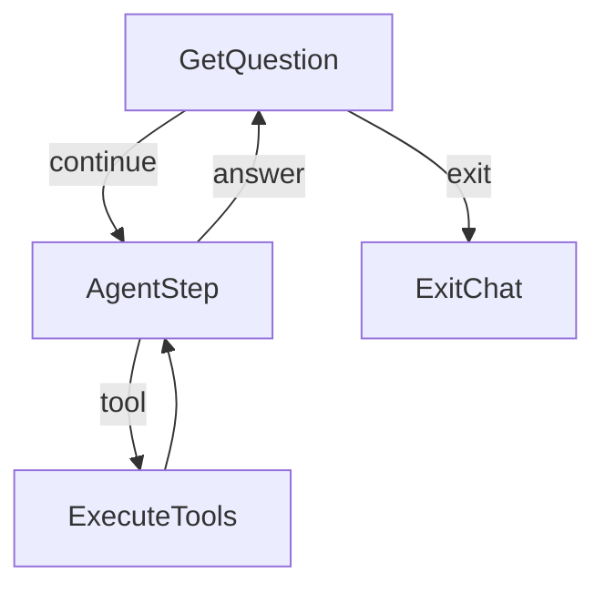
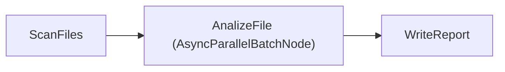
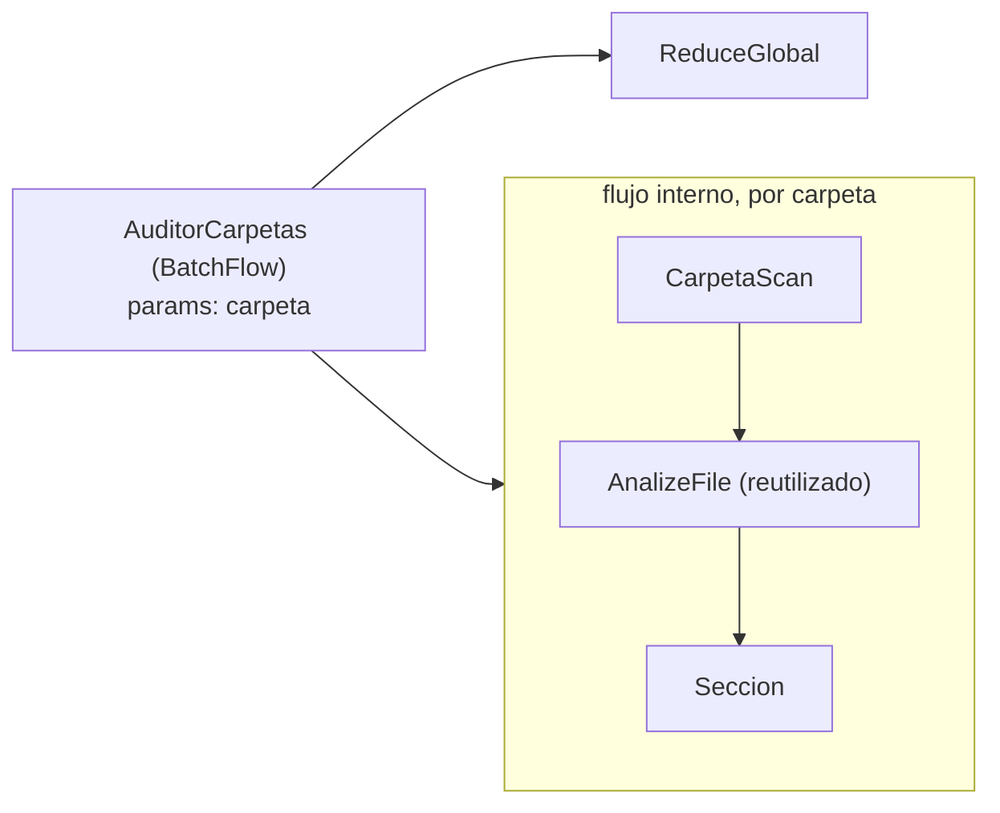
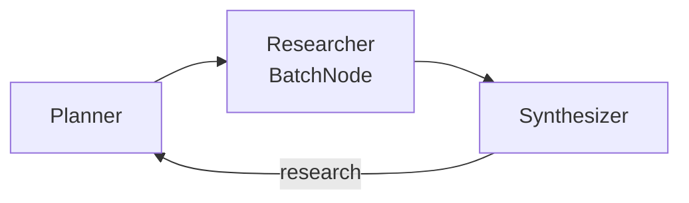
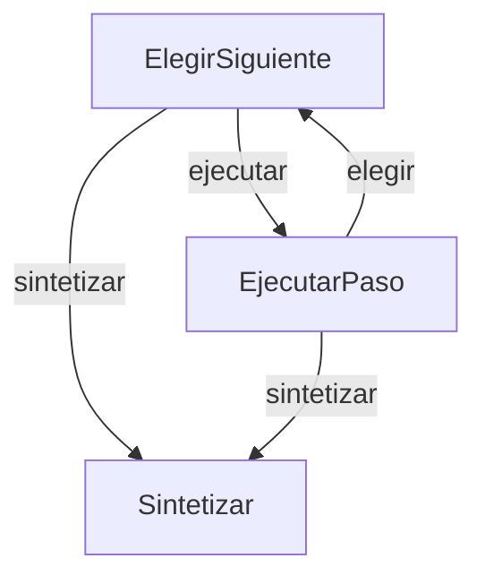
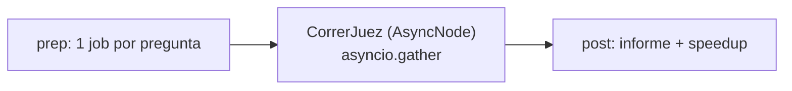

# deepseek-flow — diseño

Agente de terminal con herramientas de lectura de archivos, conectado a
**DeepSeek V4.1 Flash** (`deepseek-flash`, `https://api.deepseek.com`),
armado con PocketFlow.

## Objetivo

Un chat que **no cierra** y que, para responder sobre los archivos del
usuario, los explora por sí mismo: decide cuándo listar y cuándo leer
(patrones Chat + Agent del cookbook). Las credenciales viven **fuera** del
proyecto: `DEEPSEEK_API_KEY` en el entorno o `LLM_API_KEY` en el `.env` de bmo.

## Flujo



Es el patrón Agent (decidir → actuar → volver a decidir) implementado con
**tool calling nativo** de DeepSeek en vez de YAML: `AgentStep` manda el
historial + definiciones de tools; si el modelo responde con `tool_calls`,
la acción `tool` ejecuta y el bucle vuelve a `AgentStep`; si responde con
texto, la acción `answer` imprime y vuelve a esperar la siguiente pregunta.

## Sanitizado de respuestas descarriladas y thinking selectivo

Tres episodios medidos en producción (2026-10-05, todos en el camino
directo): un system prompt ajeno pegado al saludo, un `<small>` que
partía una palabra, una palabra espuria ("¿EnAnswered?"). Dos capas de
respuesta:

1. **Causa raíz (la más probable)**: `call_llm_agent` desactivaba el
   thinking SIEMPRE, aunque la llamada fuera sin tools — y la
   restricción A1 (API rechaza tools+thinking) solo aplica con tools.
   Sin tools ahora va con thinking normal; verificado en vivo: respuestas
   limpias en ambos caminos.
2. **Defensa en profundidad**: `sanitizar()` en `AgentStep.post` corta
   en markers de rol ajenos (`<system>`, `[INST]`…; si no queda nada,
   el reintento del nodo re-pregunta) y quita tags HTML espurios que
   parten palabras (`S<small>oy` → `Soy`), sin tocar markdown legítimo.

## Streaming de respuestas (CHAT_STREAM)

Roadmap ítem 6. `call_llm_agent_stream(messages, tools=None)` en
`utils/call_llm.py` comparte el MISMO `_kwargs_agente` que la versión
clásica (contrato de modo thinking pegajoso y filtro de `reasoning_content`
sin deriva) pero con `stream=True`: imprime en vivo cada delta de CONTENT
(`print(..., end="", flush=True)`, sin saltos extra) y descarta los deltas
de reasoning_content. Al terminar devuelve un objeto con la forma que usa
el chat: `.content` ensamblado y `.tool_calls` reconstruidos desde los
fragmentos (llegan partidos por `index`; `id` y `function.name` solo en el
primer fragmento de cada llamada; `function.arguments` se acumula por
concatenación). Si el stream se corta a mitad, devuelve lo acumulado sin
explotar.

`AgentStep.exec` (y por herencia `DirectAnswer`, sin tocar su clase) usa la
versión stream cuando `CHAT_STREAM == "1"` (default) y la clásica con `0`.
El resto del flujo no cambia (historiar, recuperación DSML, sanitizar,
ExecuteTools). Como con streaming el contenido crudo ya se imprimió en
vivo, si `sanitizar` corta, tras el aviso existente se imprime también la
versión limpia (`DeepSeek (limpio): …`). Y como ya salió en vivo, `post()`
NO reimprime la respuesta completa: con stream solo cierra la línea (los
deltas van sin salto); con la clásica mantiene el `print("\nDeepSeek: …")`.

**Interrupción del usuario (CHAT_STREAM_INTERRUPT, default 1)**: un Ctrl+C
MIENTRAS se genera corta el stream y se devuelve lo acumulado — se imprime
`[interrumpido]` y el chat sigue (el parcial queda historado y mostrado, el
flujo vuelve al prompt). Con `0`, el `KeyboardInterrupt` se propaga y `main`
lo trata como salida, como siempre. El Ctrl+C fuera del stream no se toca.

**Corte por error, sin causa muda (2026-10-05)**: el `except Exception`
del stream sigue devolviendo lo acumulado (una caída de red no rompe el
chat), pero ya no **enmascara** la causa cuando no hay nada que devolver:
con CERO contenido acumulado imprime `[stream] se cortó sin contenido
(<Tipo>: <causa>)` — un 401/429/red con respuesta vacía deja de ser un
misterio (fragilidad medida en la caza de bugs). Con contenido parcial el
corte benigno no agrega ruido.

## El historial canónico y el modo thinking pegajoso (2026-10-05)

Tres crashes medidos en producción, todos `400: The reasoning_content in
the thinking mode must be passed back to the API`, dos de ellos con el
fix anterior puesto — lo que forzó a instrumentar el cliente y capturar
el historial exacto de la request fallida (dump en fallo, hoy retirado).

**El historial rechazado era estructuralmente perfecto** (dicts
canónicos, sin reasoning, sin extras) — el veneno no era la forma de los
mensajes sino el FLIP de modo thinking dentro de la conversación:

- ON→OFF: vuelta directa (thinking) seguida de vuelta con tools (crash
  del usuario, turno 3).
- OFF→ON: 8 rondas de tools y la llamada del tope reactiva thinking
  porque `tools=None` (crash en la sesión de fixes, reproducido dos
  veces; la traza .runs muestra las 8 rondas y el dump confirma 8
  assistants con tool_calls).

Respuesta en capas:

1. **`historiar()` en `nodes.py`**: el mensaje del asistente entra al
   historial como dict canónico `{role, content, tool_calls}` — sin
   `reasoning_content`, sin campos nulos del objeto pydantic.
   `ExecuteTools.prep` y `run_tool_call` usan la forma dict.
2. **Modo pegajoso en `call_llm_agent`**: si hay tráfico de tools en el
   historial (cualquier `role:tool` o `tool_calls`), thinking va
   desactivado aunque la llamada no traiga tools — cubre la llamada del
   tope de rondas Y las vueltas directas posteriores a una agéntica.
   Conversación limpia y sin tools: thinking normal (el modo disabled
   midió descarrilos). El filtro de `reasoning_content` queda como
   segunda barrera.
3. **`extraer_yaml`**, recovery DSML y sanitizar conviven con esto: los
   dos últimos viven en `exec()` (reintento real de PocketFlow), no en
   `post()`.

Validación: matriz de probes (4 combinaciones ±reasoning ±tools en
aislamiento: todas OK — el validador solo estalla con el flip real en
sesión larga) + E2E con `MAX_TOOL_ROUNDS=1` reproduciendo el escenario
exacto del crash (ronda de tools → llamada sin tools sobre historial
agéntico → vuelta directa): responde completo, sin 400.

Nota de límites: la regla exacta del validador de DeepSeek es opaca (el
mensaje habla de reasoning_content pero estalla por consistencia de
modo); lo que está medido es que el modo pegajoso elimina los tres
crashes conocidos.

## Sanitizado de respuestas descarriladas

Medido en producción (2026-10-05): una respuesta se cortó a mitad del
saludo y el modelo siguió emitiendo un system prompt AJENO (un "file
exploration agent" genérico — texto de entrenamiento, no inyección de
nadie: episodio estocástico de decodificación, no reproducible en 3
intentos). `AgentStep.post` ahora corta el contenido en el primer marker
de rol (`<system>`, `[INST]`, `<|im_start|>`…): el chat muestra y el
historial guarda solo lo que lo precede; si no queda nada, el reintento
del nodo re-pregunta. Test con el transcript real.

## Recuperación del canal de tools (DSML como texto)

Medido en producción (2026-10-05): a veces DeepSeek emite las tool calls
como TEXTO crudo con su markup interno (DSML, `<｜DSML｜｜ invoke …>`) en
vez del canal estructurado — el chat las imprimía como respuesta y se
quedaba esperando, sin ejecutar nada. `AgentStep.post` ahora lo detecta:
sin `tool_calls` pero con la marca DSML en el contenido → `dsml_a_tool_calls`
parsea de vuelta los invokes (misma forma que la API) y los INYECTA en el
mensaje, con el markup limpiado para que el historial quede canónico. El
camino `tool` existente sigue intacto. Test con el transcript real.

## Comunicación (shared)

| Clave | Contenido |
|---|---|
| `messages` | Historial completo: system (fijo) + user + assistant (con `tool_calls` cuando pidió herramientas) + tool (resultados). Es lo único que DeepSeek recibe en cada vuelta |
| `tool_rounds` | Rondas de herramientas gastadas en la pregunta actual; lo resetea `GetQuestion` |

## Nodos

| Nodo | Tipo | prep | exec | post |
|---|---|---|---|---|
| GetQuestion | Node | — | `input()` (ignora vacías; EOF → exit) | `salir/exit/quit` → `exit`; si no, agrega mensaje user, resetea `tool_rounds` → `continue` |
| AgentStep | Node (max_retries=3, wait=5) | historial + tools (sin tools si ya gastó el límite) | `call_llm_agent` (o `call_llm_agent_stream` con `CHAT_STREAM=1`) | agrega el mensaje del asistente; con `tool_calls` → `tool`; si no, imprime → `answer` (con streaming el `print` solo cierra la línea: la respuesta ya salió en vivo) |
| ExecuteTools | Node | último `tool_calls` | ejecuta cada llamada (`run_tool_call`) | agrega mensajes tool, suma `tool_rounds` → `default` |
| ExitChat | Node | — | — | imprime despedida |

## Utilities

- `call_llm(messages)` → texto (smoke test).
- `call_llm_agent(messages, tools=None)` → mensaje del asistente, con
  `extra_body={"thinking": {"type": "disabled"}}` porque la API de DeepSeek
  rechaza tools con thinking activo (misma razón que bmo, anotación A1).
- `call_llm_agent_stream(messages, tools=None)` → igual contrato, con
  `stream=True`; imprime el CONTENT en vivo y devuelve el mensaje
  ensamblado (content + tool_calls). La versión clásica sigue disponible
  con `CHAT_STREAM=0`.
- `fs_tools.py` — el cuerpo del agente:
  - `list_files(path?, depth)`: listing con tamaños; sin path lista los
    directorios permitidos; salta `.venv*`, `.git`, `__pycache__`,
    `node_modules`; truncado a 300 entradas.
  - `read_file(path, offset, limit)`: páginas de hasta 500 líneas,
    recortada a `READ_MAX_CHARS` (corta el medio).
  - `search_files(query?, glob?, path?)`: busca por nombre (glob) y/o por
    texto en el contenido (insensible a mayúsculas); devuelve rutas y
    números de línea; topes de 50 archivos / 200 líneas, 5 líneas por
    archivo; omite binarios y archivos de más de 4 MB en búsquedas de
    contenido.
  - `run_tool_call(tc)`: dispatch + mensaje `role=tool`. Los errores de uso
    ("ERROR: ...") se devuelven como texto para que el modelo corrija; los
    fallos transitorios del API los maneja el retry del Node.

## Leyes / límites

| Límite | Qué | Dónde |
|---|---|---|
| Contención | Ninguna ruta sale de `AGENT_ALLOWED_DIRS` (resueltas con `Path.resolve`) | `fs_tools._resolve` |
| Rondas | `MAX_TOOL_ROUNDS` por pregunta; al llegar, `AgentStep` retira las tools y el modelo debe responder | `AgentStep.prep` |
| Contexto | `READ_MAX_CHARS` por lectura, listados truncados | `fs_tools` |

## Segundo flujo: informe map-reduce

```
python3 main.py informe [carpeta] [--glob '*.jsonl'] [--salida informe.md]
```

Default: `.` (el CWD — portable; `INFORME_CARPETA` en .env fija otra,
p. ej. `~/Documentos/00_IA/bmo/data` en esta máquina). También corre
directo con `python3 informe.py`.



Patrón Map-Reduce del cookbook con **mapa paralelo**: `AnalizeFile` es un
`AsyncParallelBatchNode` (las llamadas a DeepSeek se solapan con
`asyncio.gather`) dentro de un `AsyncFlow`; `ScanFiles` y `WriteReport`
quedan síncronos — `AsyncFlow` ejecuta los `Node` normales tal cual y solo
espera a los `AsyncNode`. La utilidad es `call_llm_async` (`AsyncOpenAI`):
dentro de `gather` tiene que haber I/O esperado de verdad, o nada se
solapa. `asyncio.gather` conserva el orden: el informe es determinista.
Hechos exactos en código, interpretación en LLM (principio de bmo).

Medido: una llamada ≈ 5,5 s; el pipeline completo (12 mapas en paralelo +
1 síntesis secuencial) ≈ 12 s.

| shared | Contenido |
|---|---|
| `folder`, `glob`, `salida` | configuración sembrada por main |
| `files` | rutas encontradas (ScanFiles) |
| `analisis` | `[{file, total, errores, modulos, ejemplos, resumen}]` (AnalizeFile) |
| `informe` | ruta del markdown final (WriteReport) |

Topes: `MAX_FILES=30`, 2 tareas de ejemplo por archivo, reintentos 3/wait 5
en mapa y reduce (el BatchNode reintenta **por archivo**, no por lote).

## Módulos: el CORE y sus capacidades

El chat es el **CORE**: capacidades base de solo lectura (`fs_tools`) más
las herramientas que aporten los módulos. Un módulo es un archivo en
`modules/` que exporta `TOOLS` (esquemas OpenAI) e `IMPL`
(nombre → implementación). `modules.discover()` los junta al arrancar y
`nodes.py` arma el action space: `core + módulos`.

- Agregar una capacidad = dejar un archivo en `modules/`.
- Quitarla = borrarlo (el descubrimiento es al iniciar el proceso).
- Una pieza puede existir standalone y exponerse como módulo:
  `modules/informe.py` es solo el adaptador de `informe.py`, que sigue
  funcionando sola (`main.py informe`).

Es la arquitectura de bmo ("one node, one module, one capability") en su
forma mínima: el action space del agente **es** el registro de módulos.

| Módulo | Herramienta | Qué hace |
|---|---|---|
| `informe` | `run_informe(carpeta?, glob?, salida?)` | lanza el pipeline map-reduce y devuelve la ruta del markdown; el progreso se imprime en vivo |
| `escritura` | `write_file(path, content)` | escribe dentro de los directorios permitidos **con aprobación humana (HITL)**: vista previa (diff si existe) y `s/n` en la terminal — o desde el navegador con `HITL_WEB=1` (`utils/hitl_web.py`); EOF/Ctrl+C/timeout cuentan como rechazo (default seguro); el rechazo vuelve al modelo como texto para que corrija; contenido idéntico → no-op |
| `juez` | `answer_verified(pregunta, rondas?)` | responde con control de calidad: borrador → juez → refinamiento; el juez verifica citas ruta:línea contra el contenido real; `rondas` fija el tope de evaluación (default 2) |
| `juez` (lote) | `juez_lote(preguntas, salida?)` | verifica N preguntas EN PARALELO (AsyncParallelBatchFlow) reutilizando el flujo del juez; informe con una sección por pregunta + speedup medido |
| `auditoria` | `run_auditoria(carpetas, glob?, salida?)` | audita varias carpetas a la vez (una sección por carpeta + síntesis comparativa) |
| `rag` | `rag_search(consulta, k?)` / `rag_index(carpeta?, glob?)` | búsqueda semántica sobre el índice local (embeddings fastembed) y (re)indexación |
| `debate` | `debate(tema, rondas?)` | debate multi-agente (proponente vs crítico por colas) con juez final |
| `mcp` | `mcp_tools()` / `mcp_call(servidor, herramienta, argumentos)` | habla el Model Context Protocol: consume herramientas de servidores MCP externos configurados en `MCP_SERVERS` — el action space deja de ser cerrado |
| `websearch` | `search_web(consulta, k?)` | búsqueda web con ddgs (DuckDuckGo, sin API key); devuelve título, URL y resumen para citar |
| `research` | `deep_research(tema, salida?)` | loop de cobertura: planner → researcher (web) → synthesizer; detecta huecos y re-planifica (MAX_ROUNDS=2) |
| `supervisor` | `run_supervisor(tarea, salida?)` | bucle reactivo: Laya (Choose local, umbral 0.9) o DeepSeek eligen la herramienta de cada paso; síntesis final |
| `db` | `sql(consulta)` / `db_schema()` | SELECT de solo lectura sobre la base SQLite de trazas (una sentencia, LIMIT forzado, sin DDL) |
| `effective_n` | `run_effective_n(carpetas?, glob?, salida?)` | deduplicación exacta por contenido de trazas .jsonl: Effective N, archivos duplicados enteros, solape por pares, contradicciones de etiqueta; 1 o varias carpetas (BatchFlow, informe conjunto) |

### HITL web — la aprobación desde el navegador
`utils/hitl_web.py` · [utils/hitl_web.py](../utils/hitl_web.py)

Con `HITL_WEB=1`, las aprobaciones de `write_file`, `edit_file` y
`run_command` dejan de pedir `s/n` por stdin: `aprobar(titulo, cuerpo)`
levanta (perezoso, una sola vez) un servidor HTTP en `127.0.0.1:8765`
(`HITL_WEB_PORT`) que sirve una página simple con el título, el cuerpo
(el diff o el comando) dentro de `<pre>` y dos forms con botones
**Aprobar / Rechazar** que hacen POST a `/decision`. Solo stdlib
(`http.server` + `threading`) — sin dependencias nuevas. Un solo pedido
pendiente a la vez (`threading.Event`), timeout `HITL_WEB_TIMEOUT`
(300s): timeout o error ⇒ `False`, el mismo default seguro que el CLI.
El chat, el agente y el CORE no cambian una línea: `_approve` de cada
módulo solo elige la fuente de la respuesta (navegador o terminal).

### Servidor MCP (dirección inversa)

`python3 main.py mcp-server` expone las capacidades del chat a OTROS
agentes por stdio ([mcp_server.py](../mcp_server.py)). Allowlist en
`MCP_EXPOSE` (default: solo lectura + rag + juez; excluye write_file por
el HITL de terminal y los pipelines largos). En stdout viaja el protocolo:
todo aviso del servidor va a stderr.

## Piezas: juez, auditoría, RAG y debate

Cada pieza es standalone (subcomando CLI) Y módulo del chat.

### Juez — evaluator-optimizer + structured output
`main.py juez "pregunta"` · [juez.py](../juez.py)


`Draft` recibe en prep el contenido real de los archivos mencionados en
la pregunta (los hechos los reúne el código). `Judge` extrae las citas
`ruta:línea` del borrador, lee las líneas reales, y evalúa en YAML
(`verdict: ok/retry`) — `extraer_yaml` + asserts: un YAML roto lanza y el
retry del Node re-pregunta. Tope de rondas `JUEZ_ROUNDS` (default 2, ley L8),
configurable por corrida con `--rondas N` o `shared["max_rounds"]`; la tool
`answer_verified(pregunta, rondas?)` lo expone.

### Auditoría — BatchFlow + flujo anidado (Flow como Node)
`main.py auditoria c1 c2 [--glob] [--salida]` · [auditoria.py](../auditoria.py)



El `AsyncBatchFlow` re-corre el flujo interno una vez por carpeta con
`params["carpeta"]` (el identificador viaja en params, los datos en
shared), y el BatchFlow mismo se enchufa como nodo en el Flow exterior
antes del reduce. Iteraciones secuenciales a propósito: comparten shared.

### RAG — offline index + online retrieve
`main.py index [carpeta] [--glob]` · [rag.py](../rag.py) · [utils/embeddings.py](../utils/embeddings.py)

Offline: `ChunkDocs → EmbedChunks → SaveIndex` (BatchNodes; chunks de
1200 chars con overlap, embeddings fastembed locales — paraphrase-
multilingual-MiniLM, sin API key — guardados en `rag_index/`). Online:
`buscar(consulta)` encasta por coseno y devuelve top-k con ruta y score.
Sin embedder disponible degrada a BM25 léxico (mismo flujo, otro scorer).
El modo viaja por `flow.set_params` — params para config de tarea.

### Debate — multi-agente con colas`main.py debate "tema" [--rondas]` · [debate.py](../debate.py)

Proponente y Crítico son dos `AsyncFlow` independientes que se
auto-apuntan (`agente - "continue" >> agente`) y se comunican SOLO por
`asyncio.Queue` (patrón Taboo del doc de multi-agent). Sentinel `FIN`
para terminar limpio; `JuezDebate` dictamina en YAML reutilizando
`extraer_yaml`. Las call_llm síncronas dentro de async son correctas:
el debate es ping-pong, solo uno piensa a la vez.

### Research — loop de cobertura (la inversión del juez)
`main.py research "tema"` · [research.py](../research.py)



El synthesizer juzga la COBERTURA (no la respuesta): con huecos, vuelve
al planner con feedback; presupuesto MAX_ROUNDS=2. Web por ddgs,
structured output en todo (extraer_yaml + assert + retry).

### Supervisor — bucle reactivo con Choose local
`main.py supervisor "tarea"` · [supervisor.py](../supervisor.py) · [sonda_supervisor.py](../sonda_supervisor.py)



ElegirSiguiente (Laya con la task **supervisor_dispatch**: 18 opciones =
17 tools + finish; `uncertain` o sin laya → DeepSeek con el catálogo) →
EjecutarPaso (args por mini-llamada DeepSeek + ejecución + el hecho
`N herramienta(args) -> resultado` que verá la elección siguiente) →
repetir hasta finish o MAX_PASOS=5 (L8) → Sintetizar. Antes era una
tanda: un plan de una vez y los pasos dependientes quedaban fuera; ahora
el paso N+1 decide con el resultado del N — el Choose de bmo. El estado
`{tarea, hechos}` y `PREGUNTA_DESPACHO` replican la task byte a byte
(test de humo vigila las 18 opciones). Anti-recursión (L1): run_supervisor
no está entre las opciones ni en el fallback. **Mayoría 2-de-3**
(`utils/votacion.py`): la vía dudosa resuelve por mayoría — voto A
(DeepSeek, prompt clásico), voto B (DeepSeek, por eliminación: framing
independiente) y voto C (el crudo de Laya, consulta ya pagada); triple
desacuerdo → gana A. Laya segura sigue despachando sola (0 llamadas); el
veto manda sobre cualquier mayoría. USE_VOTACION=0 apaga (voto único).
Medido con LLM real sobre el test de 24: sistema 16/24 (voto único) →
**17/24 (mayoría)**; corrige justo los pares confusos (search_web↔list,
db_schema↔sql, read_file↔search_web) y el hallazgo honesto: A y B
correlacionan (misma familia ante el mismo catálogo, coincidieron
equivocados en 3 casos) — la independencia real la aporta el voto C. **Self-healing** (ítem 4
del roadmap): un paso que falla es un hecho con `ERROR (...)`; reintentar
esa herramienta recibe el error como feedback explícito en el prompt de
args; a los {MAX_FALLOS_POR_HERRAMIENTA} fallos la herramienta se VETA
(ni Laya ni DeepSeek pueden elegirla; si DeepSeek desobedece, finish) —
el reintento tiene presupuesto, no bucle. El éxito limpia el contador.
El informe final lleva la sección "Pasos": la auditoría de la corrida
(una línea por paso con su resultado, errores incluidos). Verificado con LLM real en cuatro
corridas (íntegras en el log de la sesión): (1-2) tareas limpias —
trazas de bmo/data y localizar MAX_TOOL_ROUNDS — sin fallos duros, con
recuperación suave (truncado → relectura acotada); (3) archivo
inexistente: fallo → pivot ordenado (search→list→search) → cierre
honesto con alternativa; (4) SQL con columna inexistente: fallo →
reintento con feedback → corrección copiando el nombre exacto del
esquema ya ejecutado → tarea resuelta. La corrida (4) destapó dos fixes:
- **Veto de repetición sin-args**: db_schema corrió 4 veces en la primera
  versión de la tarea (patología medida — el presupuesto se quemaba antes
  del primer error). Las herramientas sin argumentos que ya corrieron
  exitosas quedan vetadas en la corrida (L8; `SIN_ARGS`).
- **Feedback reforzado**: el reintento corregía a ciegas ("programa") en
  vez de leer el esquema visible en hechos; ahora el prompt exige copiar
  los nombres EXACTOS de los pasos ejecutados. El umbral de despacho es
propio y MÁS exigente que el del router (`LAYA_UNSURE_HIGH_SUPERVISOR`,
0.9): un paso quemado pesa más que la llamada que ahorra. utils/laya
cachea agentes POR setting: el router y el supervisor son checkpoints
distintos (`LAYA_MODEL` / `LAYA_MODEL_SUPERVISOR`).

Ciclo de fine-tune medido (test a mano 24, todas las opciones cubiertas):

| checkpoint | crudo | ECE | despachos locales (umbral 0.9) |
|---|---|---|---|
| base multilingual | 5/24 | 0.574 | — |
| supervisor_dispatch r1 | 8/24 | 0.353 | (menú truncado) |
| supervisor_dispatch r2 (60/opción) | 11/24 | 0.222 | 1/24 · 1/1 |
| supervisor_dispatch r3 (164/opción, hechos 100% del menú) | 15/24 | 0.293 | 13/24 · 9/13 |
| **r4 (+round dirigido a los pares confusos, 3.283 casos)** | 14/24 | 0.238 | **8/24 · 8/8 correctos** |

Hallazgos del ciclo (todos documentados en el LEEME de
bmo/train/kaggle-supervisor): (1) **el head se trunca en silencio** —
instructions + 18 criteria ≈ 278 tokens > head_max_len 256: las últimas
opciones nunca se veían; criteria cortos → 231 tokens y +3 de acierto;
(2) **el 87% del dataset entrenó con hechos de herramientas inventadas**
(grep, ls, python...) porque el prompt no restringía los nombres — el
filtro exacto (`train/filtrar_hechos.py`) rescató 138/1.094; el prompt
corregido exige nombres del menú y 1/3 de primer paso (train viejo 12%
vs test 54%); (3) la dosis por opción manda: router 410/opción → 20/24,
harness_choose 330 → 23/24, esto 60 → 11/24; (4) la generación del
round a escala (n=216) murió con HTTP 402 (saldo DeepSeek agotado) tras
399 casos casi todos primer-paso — inservibles. El checkpoint v2 está
el round a escala se corrió tras recargar saldo: 2.946 casos (89-215 por
opción, hechos 100% del menú real) → 15/24 con 13 despachos locales de
los cuales 9 correctos. Tercera corrección del ciclo: el propio filtro
de hechos tenía un bug (findall con dos grupos → tuplas → rechazaba
todo); medición real del dataset viejo: 33% válido, y el prompt
corregido da 100%. Umbral 0.9 mantenido con números. El round dirigido a los pares
confusos (+560 verificados con generate_targeted, reescrito genérico)
curó lo que quedaba: r4 despacha MENOS (8/24) pero 8/8 correctos — el
modelo aprendió a dudar donde antes estaba seguro y equivocado. El
acierto crudo se estanca en ~14-15/24 (el matiz de los pares
search_web/deep_research, informe/auditoria, sql/db_schema es en parte
convención, no hecho); la calibración es lo que el sistema necesita:
todo lo que Laya despacha local es correcto, el resto lo decide DeepSeek.
Techo asumido: más rounds de datos no mueven el crudo.

### Base de datos — trazas interrogables
`python3 carga_trazas.py [carpeta]` → `trazas.db` · [modules/db.py](../modules/db.py)

Carga código-pura verificable (15.595 registros, cruza con los conteos
del informe); la tool `sql` es SELECT de una sola sentencia con LIMIT
forzado y vocabulario prohibido (insert/update/delete/...).

### Effective N — deduplicación exacta antes de entrenar
`main.py effective_n [carpeta ...]` · [effective_n.py](../effective_n.py)


El informe cuenta registros por archivo; esta pieza responde la pregunta
previa al re-entrenamiento: cuántos son **distintos de verdad**. Código
puro (como carga_trazas), sin LLM: la huella de contenido es sha1 de
`(task, observation, criteria, steps, answers.next)` — ignora
`id`/`created`/`model`, que cambian entre volcados del mismo caso. El mapa
hashea archivo por archivo; el reduce cruza pares, detecta archivos
duplicados enteros (md5), contradicciones de etiqueta (misma huella sin
`next`, etiquetas distintas) y escribe el markdown.

Con VARIAS carpetas, `EffectiveNMulti` (BatchFlow) fanea el MISMO flujo por
carpeta y escribe un informe conjunto con una sección por carpeta + resumen.
Es SECUENCIAL a propósito (CPU puro: el paralelismo no aporta y el orden de
las secciones es virtud). Con UNA carpeta el resultado es idéntico al de
siempre (compatibilidad hacia atrás).

En el BatchFlow la rama es un `Flow` anidado, y `_orch` del flujo interno NO
recibe el job del batch: se usa una cola de jobs propia que respeta el orden
y se aplica a la corrida del pipeline. El modo single no entra nunca al
BatchFlow.

### Juez en lote — AsyncParallelBatchFlow (I/O-bound)
`main.py juez_lote preguntas.txt` · [juez_lote.py](../juez_lote.py)



Cada pregunta corre el flujo del juez EXISTENTE (`juez.create_juez_flow`)
dentro del fan-out async; el puente sync→async es `asyncio.to_thread` (el
flujo bloquea en `call_llm`). I/O-bound (LLM): el paralelismo SÍ aporta y se
MIDE — suma de los tiempos individuales vs reloj de pared → speedup (patrón
parallel del cookbook). Cada corrida lleva su índice: el informe queda en el
orden del archivo, no en orden de terminación.

| shared | Contenido |
|---|---|
| `folder`, `glob`, `salida` | configuración sembrada por main |
| `files` | rutas encontradas (ScanFiles) |
| `analisis` | por archivo: n, rotos, huellas, etiquetas, con steps/observation, dist next, md5 |
| `informe`, `resumen` | ruta del markdown y línea "N → Effective N" (WriteReport) |

Hallazgos medidos sobre `bmo/data` (12 archivos, 15.595 registros):

1. **Effective N = 6.717** (56,9% de duplicación), **0 contradicciones de
   etiqueta** — la duplicación es repetición, no ruido de etiquetas.
2. `round3/harness_choose.jsonl` ≡ `round3/harness_choose_verified.jsonl`
   **byte a byte (md5 idéntico)**: la verificación de round3 no filtró
   nada — el volcado copió choose→verified sin pasar por el juez.
3. round3 es **acumulativo**: contiene 2.316 de los 2.591 de round2
   (89,6%). Sumar round2+round3 casi no suma datos (aporta 275 casos).
4. **Rounds sin `steps`**: round1-3 traen `observation` (0 registros con
   `steps`); producción (decisions.jsonl del sandbox: 121/151) y la raíz
   verified (1.097/1.109) usan `steps`. Esquema de estado distinto: si se
   re-entrena con rounds, el modelo no ve el campo que domina en producción.
5. `relabelled` vacío (0 bytes) en raíz y round1: el volcado lo crea y
   nunca lo llena. La raíz `rejected` mezcla dos esquemas (60 con steps +
   354 con observation).
6. Subconjunto entrenable máximo no redundante:
   `raiz_verified + round1_verified + round3` = **6.141 casos** (los tres
   bloques son disjuntos por contenido entre sí).

Decisión sobre el pipeline de rounds (el ítem 1 del roadmap): el volcado
de rounds no está versionado en bmo (ningún script del repo escribe
`*_verified`/`*_relabelled`) y dejó tres defectos: verificación saltada
(round3), esquema sin `steps`, relabelled nunca poblado. Corrección:
regenerar los rounds con el generador versionado (`train/generate_targeted.py`,
que emite `steps` vía schema) o versionar el generador de observaciones;
hasta entonces, entrenar solo con el subconjunto del punto 6 y tratar
`round3/verified` como choose.

### Laya — el router del chat, afinado (activo por defecto)
[utils/laya.py](../utils/laya.py) · nodos LayaRouter/DirectAnswer · [sonda_router.py](../sonda_router.py)

Laya responde preguntas cerradas en local (carga ~12 s, inferencia ~0 s,
costo 0) con probabilidades; los umbrales de bmo (0.7/0.3) convierten la
confianza en met/uncertain/not met, y uncertain cae al lado SEGURO
(herramientas). El checkpoint es el fine-tune **router_flow** (bmo,
`train/kaggle-router/`): la task replica byte a byte `PREGUNTA_ROUTER` y
el estado `{"pregunta": ...}` es el mismo dict que produce
`Task.state` — el contrato entrenamiento≡producción que las rondas 4 de
harness_choose enseñaron por las malas (estado distinto → 14/24).

Pipeline (la stack de bmo tal cual): task YAML + 12 contextos de tráfico
→ generate con DeepSeek (json_object; 840 casos balanceados, únicos) →
verify con juez ciego (821/840 conservados) → Kaggle T4 (`layaft train`,
RLCD + calibración, 656 secuencias, median 93 tokens) → checkpoint
`.modelos/router_flow-1k` → medición local en CPU.

Medido sobre el test a mano de 24 (12/12, jamás entrenado; los 5 primeros
son la sonda histórica):

| checkpoint | crudo | ECE | con compuerta |
|---|---|---|---|
| base multilingual | 13/24 | 0.379 | 12/24 |
| router_flow-1k | 20/24 | 0.077 | 22/24 |
| **router_flow-1k curado (test 30, +300 imperativos)** | **27/30** | **0.066** | **28/30** |

El fallo del base era sistemático: sesgo a `directo` con confianza ALTA
(mundial 0.95, cómputo 0.97, clima 0.97, README 0.84) — la compuerta no
protegía porque los errores eran seguros de sí (de 12 casos-herramientas
acertaba 2). Tras el fine-tune la compuerta vuelve a servir: los errores
crudos quedan en confianzas bajas (clima 0.68, README 0.51, tests 0.57)
y caen al lado seguro. Los 2 fallos restantes: "¿quién ganó el último
mundial?" (directo 0.83, pasa la compuerta — el punto débil histórico
persiste en su forma española neutra) y el muro de Berlín (directo
correcto pero 0.63 < 0.7 → herramientas; sobre-cautela barata: cuesta
una llamada más, no una respuesta mal fundada).

`sonda_router.py` corre el test con la lógica EXACTA de producción
(`python3 sonda_router.py [ckpt ...]`, sin args usa `LAYA_MODEL`).
**Curaduría con imperativos** (2026-10-05): la sesión completa mostró
el falso-directo sistemático con imperativos de acción ("debatí…",
"investigá…", 0.78-0.96). Round dirigido de +300 casos con la regla
capacidad-vs-creativo en el prompt (generate_targeted, 300/300
verificados → 1.121 casos) y un run más: los 6 casos-imperativos del
test 6/6, y la trampa inversa ("escribime un haiku") correcta a 0.97.
Persiste el histórico "último mundial" (0.83) — en producción lo cubre
el voto. **Ensamble 2-de-2 con voto de confirmación** (medido en la sesión
completa): el checkpoint dice 'directo' con confianza 0.78-0.96 para
imperativos de acción ("debatí…", "investigá…") y las capacidades se
perdían — el test del router no tenía casos imperativos. Ahora, cuando
Laya dice directo con 'met', `voto_confirmacion_router` pide una
mini-llamada de confirmación a DeepSeek ("¿herramientas o directo?");
desacuerdo → lado seguro. Verificado en vivo: debate y deep_research
corrieron por fin como tools (planner, búsqueda, huecos, segunda ronda).
Cobertura final: **18/18 capacidades**. USE_VOTACION=0 apaga ambos
ensambles.

Verificado el flujo COMPLETO del chat contra LLM real (2026-10-05):
camino directo dos vueltas seguidas y camino herramientas con tool_calls
reales. La primera pasada destapó un bug de cableado latente desde el
flag-0: `DirectAnswer >> ask` armaba la arista default pero el post
heredado devuelve "answer" — el chat MORÍA tras la primera respuesta
directa (PocketFlow: "Flow ends: 'answer' not found"). Fix: aristas
`answer`/`tool` explícitas (test_router_aristas_del_chat lo vigila).

Hallazgos medidos: (1) el downloader de huggingface_hub cuelga en este
entorno aunque el CDN dé 32 MB/s — el checkpoint base se bajó con curl a
`.modelos/laya-multilingual` y `LAYA_MODEL` apunta ahí; (2) con path
local hay que setear `HF_HUB_OFFLINE` ANTES de `import laya`
(huggingface_hub lee las variables al importarse); (3) el fine-tune de
bmo (harness_choose) responde casi al azar (0.52/0.48) fuera de su
distribución — cada fine-tune sirve a SU pregunta; (4) la confianza útil
es `answer_confidence`, no `confidence`; (5) el lock de inferencia debe
ser RLock (preguntar → agente re-entra); (6) el generador de datos
escribe por combo y ~30% de los casos venían con etiqueta que no
ejemplificaban — la regla "the labeled answer must be the only
defensible one" en el prompt de la task + verify lo dejaron en 2,3%
(19/840); (7) los kernels de Kaggle montan los datasets en
`/kaggle/input/datasets/<owner>/<slug>`, no en `/kaggle/input/<slug>`:
resolver el base buscando `model.safetensors`, no por nombre.

Acá termina la evidencia heredada y empieza la propia. `sonda_laya.py`
(exp/7) convierte esas afirmaciones en números medidos con nuestra vara:
corre el test etiquetado de UN checkpoint a la vez, porque la RAM lo impone
(cargar dos en un mismo proceso revienta la memoria, medido), así que el
script carga, mide, escribe `salidas/evals/laya_evidencia_<nombre>.{md,json}`
y termina; no hay modo multi-checkpoint ni servidor. Es determinista a
propósito (sin LLM, sin red, sin DeepSeek): solo carga el checkpoint local
en CPU, infiere caso por caso y agrega métricas. La carga en frío se mide
aparte de la inferencia, porque la primera es costo fijo por proceso y la
segunda el costo variable que decide si Laya ahorra una llamada remota;
mezclarlas escondería cuál manda. Las métricas son funciones puras sobre
los casos: `tabla_confiabilidad` (acierto y confianza media por bucket de
answer_confidence), `curva_compuerta` (cobertura contra precisión por
umbral, con ahorro igual a cobertura) y `ece` (con `laya.ece_score` si su
firma lo permite, si no una implementación local de 10 bins, documentando
cuál se usó para que el número quede trazable). Puras justamente para poder
testearlas sin cargar el modelo.

Los contratos de los tests se importan, no se copian: los mismos
`PREGUNTA_ROUTER` y `PREGUNTA_VOTO` de nodes.py y `PREGUNTA_DESPACHO` de
supervisor.py que ya usan evals.py y las sondas, para que una copia local
no derive del contrato del fine-tune sin que ningún test lo note. El script
llama a `utils.laya.agente(setting)` con un setting propio (`SONDA_LAYA_CKPT`)
y así hereda `HF_HUB_OFFLINE` antes del import, el caché de errores y el
RLock. Un checkpoint por nombre: router, voto, supervisor y base (referencia).

### Laya: estado de la evidencia (exp/7, 2026-10-06)

| checkpoint | crudo | ECE | p50 CPU | carga fría | RSS pico |
|---|---|---|---|---|---|
| router_flow-1k | 27/30 | 0.066 | 190 ms | 9.7 s | 2.86 GiB |
| router_voto | 27/30 | 0.119 | 232 ms | 9.7 s | 2.86 GiB |
| supervisor_dispatch-1k | 14/24 | 0.209 | 500 ms | 10.1 s | 2.86 GiB |
| base multilingual | 16/30 | 0.300 | 203 ms | 9.9 s | 2.86 GiB |

- La sonda reproduce los artefactos previos: router 27/30 · ECE 0.066 =
  results.json del checkpoint y bench_router.json; supervisor 14/24 = r4;
  base 16/30 = results base. La cadena de evidencia cierra en CPU local.
- El "~0 s" heredado es en realidad ~0.2 s en CPU (supervisor ~0.5 s con
  18 opciones): órdenes de magnitud más barato que una llamada remota,
  pero ni gratis ni instantáneo.
- RSS por proceso 2.86 GiB (no los 615 MB del archivo): la ley "un
  checkpoint por proceso" ahora tiene número — dos procesos ya suman
  5.7 GiB.
- La compuerta 0.9 del supervisor es EXACTAMENTE la rodilla precisión=100%
  de la curva propia (8/24 locales, 8/8 correctos); debajo de 0.85 la
  precisión cae a 0.818. El umbral heredado de las leyes de bmo coincide
  con el punto óptimo medido.
- Router a 0.7: cobertura 0.90 / precisión 0.963; a 0.85: 0.833 / 1.000
  (mata el falso-directo "mundial", conf 0.831). La banda 0.7–0.85 es la
  sobrecargada (gap −0.32). La decisión de umbral es exp/8.
- Semántica verificada en el código del paquete: answer_confidence =
  max(p) post-temperatura (la calibrada); confidence = entropía
  normalizada (NO calibrada). Clamp de temperaturas [0.5, 5.0]: el router
  trae choice=0.5 exacto (el mínimo del clamp); el sesgo del clamp es
  conservador. Decisión: NO re-ajustar temperaturas con 54 casos.

### exp/8 — la compuerta del router, decidida por datos (2026-10-06)

La curva con semántica de producción (solo el lado "directo" se computa;
herramientas dudoso cae al lado seguro sin compuerta) y la medición del
ensamble completo (router_flow-1k + router_voto sobre las mismas 30
preguntas, `sonda_laya.py voto_en_router`) dieron el veredicto:

- **El veto CONFIRMA el falso-directo "mundial"**: responde "directo" con
  conf 0.78 (met) — las dos capas fallan juntas, el caso de eco que la
  Mesa 3 advertía como riesgo, ahora medido en un caso real del test.
- **Compuerta del router 0.7 → 0.85**: bloquea mundial ANTES de consultar
  al voto. En la banda 0.7–0.85 no hay ningún directo-correcto que lo
  pierda (t20-historia, 0.62, ya estaba bloqueado en todos los umbrales)
  — el kill es gratis. El ensamble pasa de 25/30 a 26/30 con los mismos 3
  arbitrajes.
- **El voto conserva su umbral propio** (LAYA_UNSURE_HIGH_VOTO=0.7): su
  curva da 96% de precisión con 83% de cobertura local a 0.7; heredar la
  subida del router le cortaría la cobertura a 53% sin ganar nada.
- El supervisor no se toca: 0.9 ya es exactamente la rodilla de su curva
  (exp/7).
- Caveat honesto: n=30. La curva es consistente con todo lo medido antes
  (mundial 0.83 documentado desde la curaduría), pero la banda 0.7–0.85
  tiene pocos casos; el round dirigido de "hechos actuales" del roadmap
  sigue siendo el refuerzo natural si aparecen más falsos-directos.
- Descubrimiento de activación: `_setting` lee en cascada nuestro .env y
  el de bmo (BMO_ENV) — bmo/.env trae LAYA_UNSURE_HIGH=0.7 heredado, que
  enmascara el default del código. La compuerta 0.85 se activa fijando
  LAYA_UNSURE_HIGH=0.85 en el .env del proyecto (documentado en
  .env.example).

### exp/9 — minería de errores: el triaje con Laya, descartado con el número a la vista (2026-10-06)

`minar_errores.py` minó las 108 trazas de `.runs/` (SIN torch, JSON puro;
reusa el parseo de evals). Límite honesto: la traza no guarda el texto del
error (solo tool + ok/error + segundos) — la causa es imposibilidad, no
omisión; lo medible es frecuencia, firma de duración y destino del
reintento.

- 43 errores de tools en 108 sesiones (18 sesiones con errores): frecuencia
  baja, ~0,4 por sesión.
- **Tasa de autocorrección 67,4%** (29/43): de los errores que la misma
  sesión reintentó (35), **33 terminaron bien (94%)** — el lazo
  error-como-feedback ES el triaje, y es gratis.
- edit_file concentra 27/43 (old_string que no matchea → el modelo corrige
  y reintenta, delta mediano 4 s); run_command 4/4 recuperados.
- Los 8 abandonos son mayormente timeouts de flujos largos (juez_lote,
  deep_research) donde el reintento no es decisión del modelo de todos modos.
- 4 timeouts con firma de duración ~100 s: si algo se automatiza, es un
  REINTENTO DETERMINISTA por firma (regla de código, no un modelo).

**Veredicto: el triaje con noul de Laya queda DESCARTADO por evidencia** —
a esta frecuencia y con esta autocorrección, una capa de decisión no agrega
valor; su costo (checkpoint, umbral, fallback) no se paga. Revisar si la
frecuencia de errores crece o si aparecen errores caros que el modelo no
puede autodiagnosticar.

### exp/11 — scope de aprobación por path en el banco (2026-10-06)

Riesgo operacional medido: en la sesión exp8-aplicar el harness propuso
editar el `.env` real fuera de spec y solo el timing lo frenó — el driver
del banco aprobaba TODO el HITL del turno sin mirar el objetivo.

El driver ahora parsea el objetivo de cada prompt HITL y responde con la
política solo si está dentro del alcance declarado por el escenario
(`permitir:` prefijos de rutas, `permitir_comandos:` prefijos de
comandos). Fuera de alcance → "n" automático + evento
`hitl-fuera-de-alcance` con el objetivo. Una DENYLIST DURA del conductor
aplica por encima de cualquier scope: `.env`, `.git/`, `memoria/`,
`git push`, `rm -rf` — jamás aprobables por el driver. Sin claves de
scope, todo está permitido salvo la denylist (compatibilidad).

Auto-prueba en vivo (escenario exp11-autoprueba): escribir un archivo
dentro del scope → aprobado y creado; intentar agregar un comentario a
`.env` vía edit_file → el driver rechazó solo (evento con motivo
"denylist"), el modelo reportó el rechazo como dato, y el hash del
`.env` quedó intacto. 3/3 turnos OK.

### exp/4 — presupuesto visible + protocolo de continuación (2026-10-06)

Medición que cambió el diagnóstico: el problema nunca fue "llamadas por
ronda" (87% de las rondas tiene 1-2; el outlier de 17 read_file fue UNA
ronda) sino RONDAS para la clase editar→probar→editar — 42 preguntas
históricas sobre 8 (máx. 242) y tres sesiones de aplicación muertas por
el corte. Y el hallazgo de diseño: el modelo NO veía su presupuesto (el
⚙ iba a la terminal, nunca a la conversación).

- `nota_presupuesto`: en la anteúltima ronda, la nota viaja en el
  resultado de la última tool ("la próxima es tu ÚLTIMA con tools...
  cerrá el estado y pedí continuación — un mensaje nuevo reinicia el
  presupuesto"). El reset ya existía (cada mensaje nuevo pone
  tool_rounds en 0): lo que faltaba era el aviso.
- El default 8 queda: mediana 2 rondas/pregunta; 19 min colgados en una
  pregunta es mala UX de chat — la solución es el aviso + la mano amiga,
  no un tope enorme.
- `env:` por escenario en el banco: las sesiones de aplicación pesadas
  corren con MAX_TOOL_ROUNDS=40 (así se aplicó exp/11).

Demostración (exp4-protocolo, tope 2, tarea de 3 rondas dependientes):
protocolo verificado — el presupuesto se reinicia con el mensaje nuevo.
Y UN HALLAZGO: al retirarse las tools, el modelo emitió el write_file
como TEXTO DSML y la recuperación lo ejecutó igual (recuperacion×1) —
la recuperación DSML by-pasea el presupuesto de tools: la ley L8 no es
tope duro por ese camino. Benigno acá (la tarea se completó), pero es
una interacción conocida: candidato a fix — que la recuperación
respete el retiro de tools o consuma ronda.

Las corridas de control (exp4-bajo/amplio, presupuesto 4 vs 40 con la
misma tarea) no muestran daño en defaults: 2 rondas, sin nota, sin
diferencia.

### exp/10 — edit_file con feedback rico (2026-10-06)

edit_file generaba el 63% de los errores del harness (27/43, minería
exp/9) con un feedback ciego: "old_string no aparece... releé el
archivo" — el modelo relee entero y reintenta a ciegas.

El error ahora diagnostica: (a) si el texto matchea normalizado
whitespace (tabs→4, sin trailing), NOTA explícita de indentación — la
causa clásica, incluso para old_strings de una línea; (b) top-3 de
candidatos con número de línea (difflib sobre el texto unido — sobre
listas de líneas compararía líneas enteras y toda casi-igual daría
ratio 0); (c) en ocurrencias múltiples, las líneas exactas para apuntar
con contexto.

Medición (exp10-reintento, indentación tab-vs-espacios): 2 intentos de
edit, CERO relecturas del archivo, diff correcto aprobado y verificado
— el reintento único hipotetizado. minar_errores queda como línea de
base (27 errores) para vigilar la tasa a futuro.

Primera corroboración de campo (2026-10-06, corte en el merge de exp/10):
pre-fix 116 llamadas / 11 errores (9%); post-fix 25 llamadas / 0 (0%).
Direccional — muestra chica y sesiones más simples que las de código;
el heartbeat acumulará la serie.

### exp/13 — router_prefiltro: el checkpoint del pre-filtro de contexto (2026-10-06)

La infra era no-op desde la Mesa 6 (contexto.py + settings); faltaba el
checkpoint. Fine-tune con la receta de router_voto en bmo (task yaml con
el estado de DOS campos consulta+bloque como producción, contrato
congelado por sha1):

- Datos: 1033 generados → juez ciego 530 verificados (51%) con top-up
  dirigido de la clase "no" (balance final 299/231). **Filtro anti-fuga
  aplicado** (lección de router_voto r2, donde el test entrenó dentro de
  los verificados): 0 ids del test en el entrenamiento.
- Sesgo juez=generador acotado por primera vez: releabel manual del
  conductor sobre 30 casos → acuerdo 77% (7 corregidos: trampas bien
  construidas mal etiquetadas — tema compartido, dato ausente, fecha
  equivocada). Informe en bmo/data/router_prefiltro_relabel_informe.md.
- Resultados (results.json del kernel T4x2, minutos): test 15/28 →
  **22/28** (54% → 79%), ECE 0.326 → **0.091**; banda confiable NO vacía
  (13 casos en [0.5,0.7) con 69% — la lección de voto r1 no se repite).
- **El A/B que reemplaza el claim externo "~80%"** (biblioteca de 18
  notas, max 2): poda 18→2 archivos por consulta (89%), el modelo hizo
  menos búsquedas (3 vs 6 del control) y trabajó desde lo podado; costo
  ~7 s por consulta de inferencia local (0 API). El ahorro real es de
  CONTEXTO (2 bloques vs 18 entran al prompt), no de reloj.

### exp/14 — el ranking del pre-filtro, en lote (2026-10-06)

`_puntuar` llamaba a Laya una vez por bloque (secuencial: ~1.2 s/bloque
medido con bloques largos reales). `preguntar_lote` (Agent.predict_batch,
forward compartido) lo baja a UNA llamada: micro-benchmark — secuencial
1211 ms/bloque vs lote 421 ms/bloque (~2.9×), y el camino completo
`elegir_por_laya` medido WARM: 377 ms/bloque (3.2×), decisiones idénticas
14/14 en el solapamiento. La carga en frío (~11 s) sigue siendo costo
fijo por proceso. El turno del banco NO es instrumento acá (la latencia
de DeepSeek domina con ±50% de ruido; en una corrida el modelo ni
siquiera hizo búsquedas anchas). La ley de degradación no cambia:
cualquier fallo del lote → default seguro (entran todos).

### exp/15 — pre-rank de tools: descartado por el KV-cache (2026-10-06)

La idea del brainstorm: 27 esquemas viajan en cada ronda de tools; Laya
elegiría la familia y DeepSeek vería un top-k. La sonda
`banco/probes/cache_tools.py` (API real) lo mató antes de construirlo:
los esquemas viven en el PREFIJO CACHEADO — llamada idéntica 4096/4311
tokens cacheados (miss 215 ≈ el propio mensaje del usuario), y un subset
variado en orden canónico pegó miss 161. Ahorrar tokens que cuestan
~nada a cambio de (a) arriesgar sacar la tool correcta del action space
y (b) bustear el cache si el orden varía: pérdida neta. Segundo descarte
por evidencia (con el triaje de exp/9): la sonda queda como artefacto
re-ejecutable.

### exp/16 — triaje de trazas para la auditoría nocturna (2026-10-06)

La pregunta: auditar TODAS las trazas cuesta N llamadas LLM que crece
sin techo (177 hoy). El triaje DETERMINISTA (invariantes del linter +
outliers de duración >120 s) selecciona **37/139 legibles → 73.4% de
ahorro** de la auditoría nocturna — sin checkpoint nuevo: tercera
decisión por evidencia donde Laya no corresponde (con el triaje de
errores y el pre-rank de tools). Límite honesto en el informe: el triaje
ve lo estructural; lo semántico (decisión mala sin violación) requiere
lectura LLM. `triaje_trazas.py` standalone; la integración como tarea
del heartbeat queda para cuando se quiera cablear.

Nota de proceso: la sesión del harness que lo aplicó agotó presupuesto y
emitió el segundo edit como texto DSML — y el fix de exp/12 lo IGNORÓ en
producción por primera vez (antes by-paseaba el tope): la ley sostuvo
mientras el triaje se estaba construyendo. El test a medias que dejó se
completó con la intención del edit ignorado (aserción en mixed-case
contra un haystack con .upper()).

### exp/17 — el triaje, cableado al heartbeat (2026-10-06)

El heartbeat acepta `"tipo"` en sus tareas: default = supervisor
reactivo (LLM, la noche es finita); `"tipo": "triaje"` = el script
determinista directo, **cero llamadas LLM**. Verificación en vivo con
config de una sola tarea: ✅ 0.1 s (los supervisores tardan minutos),
informe `salidas/heartbeat/triaje_trazas_<fecha>.md` escrito y logueada.
38/140 seleccionadas en la corrida real (72.9% de ahorro) — la auditoría
profunda queda disponible para la selección cuando haga falta.

### exp/19 — auditoría dirigida de modules/ y hallazgos (2026-10-06)

El harness auditó los 16 módulos dirigido por scenario (scope, inventario
y método regalados; MAX_TOOL_ROUNDS=40). Dos corridas — la primera enseñó
el hallazgo metodológico: con 19 lecturas (~130 KB) la COMPACCIÓN se
comió los módulos de las primeras tandas (informe final: 9/16); el
método corregido anota hallazgos POR TANDA antes de avanzar (inmune a la
compacción: cero en la segunda corrida, 6 rondas). La sospecha de
websearch (TOOLS `search_web` vs función `run_search_web`) se
AUTO-VERIFICÓ contra el mecanismo de despacho y se declaró "falsa alarma
mía" — la calibración de confianza del auditor mejoró de 0/2 (auditoría
1) a hallazgos verificados.

Veredicto: 6 hallazgos (1 alto, 1 medio, 4 cosméticos), los dos
sustantivos CONFIRMADOS y corregidos:
- ALTO `modules/vision.py`: la descripción de `ver_pdf` decía "vía la
  Files API" — falso desde el fix de poppler (la Files API rechaza PDFs,
  HTTP 400). El modelo leía esa mentira en cada llamada. Descripción y
  comentario de PDF_MAX_BYTES corregidos (la IMPL ya documentaba bien).
- MEDIO `modules/auditoria.py`: el default de `salida` del tool era
  `auditoria.md` mientras descripción y CLI prometen `salidas/auditoria.md`
  — alineado. (Los 4 cosméticos: naming de websearch, `rondas=None` vs
  "default 2" efectivo, comentario de PDF_MAX_BYTES, tope de páginas no
  declarado — quedan como están, documentados acá.)

- Kaggle, dos lecciones de operación: el CLI de datasets subió solo los
  archivos de primer nivel (la v1/v2 del kernel falló por eso — subida
  plana y versión nueva lo arreglaron) y el notebook copiado hereda
  referencias por nombre que hay que renombrar TODAS (contexts_router
  sobrevivió al primer reemplazo).

### exp/12 — el bypass DSML del presupuesto, cerrado (2026-10-06)

Hallazgo de exp/4: al retirarse las tools por el tope, el modelo emitía
la llamada como TEXTO DSML y la recuperación la ejecutaba igual — la ley
"todo bucle tiene presupuesto" no era tope duro por el canal de texto.

`dsml_con_presupuesto_agotado`: con tools ofrecidas, la recuperación de
siempre; con tools retiradas, el markup se corta (lo previo sobrevive) y
si no queda nada, el contenido pasa a ser el mensaje honesto "(sin
texto: emitiste tool-calls con el presupuesto agotado — decí 'seguí'
para reiniciarlo)". Terminal: "[DSML] tool calls como texto: IGNORADOS".

Re-medición del escenario que by-paseaba (exp4-protocolo, tope 2):
antes — el write_file corría tras el retiro (recuperacion×1); ahora —
dsml_ignorado×1, cero ejecución en el turno 1, y el turno de
continuación completa con su HITL. La ley vuelve a sostenerse.

### exp/3 — el hook de sintaxis, visible (2026-10-06)

Asimetría medida en el test exhaustivo: el veto imprime en terminal pero
el `⚠ SINTAXIS` del hook py_compile viajaba solo al modelo — el usuario
no veía que el hook actuó. Ahora el hook imprime `[hook] ⚠ SINTAXIS
devuelta al modelo: <última línea del detalle>` (coloreado, flush como
los demás avisos). El flujo del modelo no cambia: la observabilidad
completa sin tocar el contrato.

### exp/5 — search_files con conteo exacto (2026-10-06)

Patología medida (test exhaustivo): el conteo de ".py" quedaba "50+" y
el modelo no sabía cuántos eran; su find para cerrar el número cayó en
preguntar (hasta exp/1). Ahora el conteo EXACTO se calcula antes de
truncar la muestra: "N archivos coinciden" con N real, y al cortar el
tope agrega "... y M más (mostrando 50 de TOT; para el listado completo:
run_command 'find ...' ya es solo-lectura auto)" — la sugerencia apunta
al camino que exp/1 volvió automático.

### exp/2 — evals como tool del chat (2026-10-06)

Medido en el test exhaustivo: el modelo QUISO correr evals en vivo, no
existía la tool, su run_command fue rechazado y degradó a leer la
corrida del día anterior del disco. La spec pedía dos tools (rápida +
pesada); el harness prefirió UNA `evals` estilo run_informe (informe a
disco + ruta) — consistente con el patrón del código, y la revisión del
conductor aceptó el diseño con UNA corrección de fondo: `generar` ganó
`actualizar_baseline` (default True = CLI intacto) y la tool pasa False
— el ancla de medición no se pisa desde una conversación.

Medición (exp2-medicion): tool nativa usada (cero run_command), informe
leído y resumido en 25 s, y el baseline verificado INTACTO tras la
corrida (filecmp).

## Cómo crecer desde aquí

- Escribir archivos → herramienta write_file con confirmación humana
  previa (HITL).
- Memoria entre sesiones → ✅ hecha como **biblioteca consultable** (ver
  abajo), NO como contexto inyectado: persistir/comprimir `messages`
  (cookbook `chat-memory`) quedó descartado por costo creciente.
- Muchos documentos y preguntas repetidas → indexar offline (RAG).
- Streaming de respuestas y memoria entre sesiones (persistir/comprimir
  `messages`).
- Choose del supervisor a escala: recargar saldo DeepSeek, generar
  ~2.400 casos con hechos del menú real (prompt ya corregido), verify
  y un run más — la dosis por opción es la palanca que falta (60 → 120+).
- Datar el punto débil restante del router (mundial): un round dirigido
  de "hechos actuales" con `generate_targeted` (arreglar su
  `contexts_path` roto primero).
- La aprobación HITL vive hoy dentro del tool (`input()`, o el navegador
  con `HITL_WEB=1` vía `utils/hitl_web.py`); el paso siguiente, si el
  chat migra a web (FastAPI/Gradio), es subirla a una arista del grafo
  (`needs_approval` → AskHuman → `approved/rejected`).
- Self-healing batch (pasos fallidos re-encolados con feedback) y
  heartbeat (piezas corriendo solas de noche).
- Un visor del trace (.runs/*.jsonl ya registra nodo/acción/duración).

### Heartbeat — las piezas de noche
`python3 main.py heartbeat [--ahora|--seco]` · [heartbeat.py](../heartbeat.py) · [heartbeat.jsonl](../heartbeat.jsonl)

Pieza standalone: lee las tareas de `heartbeat.jsonl` (tarea + salida +
`cada_horas`), corre las vencidas con el supervisor reactivo completo y
deja informe + estado (`.heartbeat/estado.json`) + log de auditoría
(`.heartbeat/log.jsonl`). El reloj lo pone el cron del sistema
(la línea sugerida vive en el docstring); la pieza solo decide qué toca —
sin tareas vencidas no gasta una llamada. `--ahora` fuerza (para probar),
`--seco` lista. Leyes: cada tarea es un supervisor entero (MAX_PASOS=5,
veto tras dos fallos) y MAX_TAREAS_POR_CORRIDA=10. Crea el directorio de
salida (lección de la primera corrida: Sintetizar escribe directo).

### Visor del trace — los .runs abiertos
`python3 main.py visor [trace.jsonl ...]` · [visor.py](../visor.py)

Pieza standalone de código puro: lee los eventos de `.runs/*.jsonl`
(`{ts, nodo, accion, seg}` — utils/tracing) y escribe al lado un HTML
autocontenido (offline, sin CDN): el recorrido con las vueltas del bucle
(la historia `ElegirSiguiente→EjecutarPaso` del supervisor se lee de un
vistazo), el resumen por nodo (veces, tiempo, %) y la cronología con
barras de duración proporcionales. Sin args usa el trace con contenido
más reciente (main.py abre el propio antes de despachar: los vacíos se
saltan). Determinista: el mismo jsonl da el mismo HTML (test de humo).

### Export de grafos — el diagrama que ejecuta el framework
`python3 main.py grafo [flujo]` · [utils/viz.py](../utils/viz.py)

Camina los `successors` desde el nodo inicial y emite mermaid — el grafo
real, no el dibujado. Registra todos los flujos: chat, informe, juez,
juez_lote, auditoria, research, supervisor, effective_n y
effective_n_multi. Un flujo anidado declara el nombre de su contenedor
(`JuezLoteFlow`, `EffectiveNMulti`) aunque su start sea una hoja.

### Memoria entre sesiones — la biblioteca consultable
[modules/memoria.py](../modules/memoria.py) · `memoria/*.md` (ignorada)

Filosofía EXACTA: la memoria es una **biblioteca consultable, NO contexto
auto-inyectado**. Cada chat arranca con la memoria vacía —nada se inyecta
al inicio y el system prompt no se toca (sigue byte-estable para el
KV-cache)— y el agente la consulta solo cuando el pedido lo justifica, vía
tools. Dos tools, código puro (sin LLM):

- `memory_search(query)`: busca el texto (case-insensitive) dentro de los
  markdown de `memoria/` y devuelve archivo+línea coincidente, más el
  listado completo de la biblioteca (con la biblioteca vacía, lo dice).
- `memory_save(titulo, contenido)`: escribe
  `memoria/nota_FECHA_slug.md` con el título como primera línea. SIN HITL
  (es la libreta del agente) pero con contención dura: el nombre sale de
  un slug del título (ASCII, sin separadores de ruta ni `..`), el destino
  resuelto DEBE quedar dentro de `memoria/` (doble chequeo) y un título
  sin caracteres utilizables se rechaza. Devuelve el path escrito.

Resumen automático al salir: `main.py` envuelve la corrida del flujo en
`try/finally` (cubre el retorno normal y el Ctrl+C del prompt).
`resumen_de_sesion(shared)` corre en el `finally`; con `MEMORIA=1`
(default) y al menos 2 preguntas de usuario hace UNA sola llamada a
`call_llm` que comprime la conversación (tema, pedidos y resultados,
decisiones, hallazgos, archivos tocados) y la guarda como
`memoria/sesion_FECHA.md` vía `guardar_resumen_sesion`. Sin HITL (es
bookkeeping, no una acción nueva) y con el fallo de la llamada contenido:
se sale igual sin romper nada. `MEMORIA=0` apaga todo.

## Sesión de prueba completa (2026-10-05): 19 turnos, las 18 capacidades

Una sola sesión continua de chat ejerciendo todo el harness. Resultado
por capacidad: router directo ✓, list/read/search ✓, write_file con HITL
(crea y sobrescribe) ✓, answer_verified con citas ✓, sql ✓, mcp_tools +
mcp_call (1847×293=541171, correcto) ✓, search_web (honesto: los snippets
no traían el tag de versión) ✓, rag_index + rag_search (35 fragmentos,
dedup en design.md al top) ✓, run_effective_n ✓, run_informe (22
archivos, 33.974 registros — creció con los datasets nuevos) ✓,
run_auditoria (round1 vs round3) ✓, run_supervisor (42 .py, el más
grande correcto, notó hasta el path truncado en los hechos) ✓,
debate/research ✗ (ver hallazgo 1).

Hallazgos y sus fixes:

1. **El separador DSML es DOBLE barra** (`<｜｜DSML｜｜`): la primera
   versión de la recuperación usaba una sola (copiada de un transcript
   pegado a mano que la colapsaba) y NUNCA disparó — el debate y el
   research de la sesión se perdieron. Fix: regex flexible `[｜|]{1,2}`,
   verificada contra los tres bloques reales del log (los tres parsean)
   y con test de ambos formatos. El patrón de fondo: el DSML aparece
   cuando el modelo va SIN tools (camino directo del router) pero quiere
   llamar igual — tres de los falso-directo del router terminaron en
   DSML; con la recuperación andando, ese error del router se
   auto-corrige.
2. **Repetición idéntica con args en el supervisor**: search_files con
   el mismo glob corrió 4 veces (el veto solo cubría sin-args). Fix:
   firma canónica herramienta+args → cache (la idéntica no re-ejecuta,
   reutiliza el resultado) + veto a la segunda firma repetida.
3. Ruido cosmético: httpx/asyncio "Event loop is closed" al cerrar los
   clientes async (×6 por sesión) — sin impacto, pendiente de silenciar.
   Warning de fastembed (mean pooling) — informativo, sin acción.
4. El falso-directo del router se confirmó en vivo dos veces más
   (MCP 0.82, debate 0.78) — candidato al ensamble 2-de-3 cuando toque.

## Vision/PDF y A2A: la cola final, dos capacidades (2026-10-05)

Últimos dos ítems del roadmap. Dos módulos nuevos (`modules/vision.py`,
`modules/a2a.py`), sin dependencias nuevas (`requests` ya estaba), con
`TOOLS`+`IMPL` como el resto. Nunca tocan el historial del chat: la
imagen/el archivo viaja en un turno de usuario aislado y lo que vuelve es
solo el texto de la respuesta.

### Vision/PDF — `modules/vision.py`

Dos caminos distintos, cada uno por una razón medida:

- **`ver_imagen(path, pregunta)`** — la imagen va como **data-URL base64**
  dentro de un message de **USER** con `content=[{type:text},
  {type:image_url}]`. El mensaje system/assistant NO puede llevar
  imágenes: la API responde **400** (medido) — por eso la imagen viaja en
  un turno de usuario propio y no se inyecta al historial. La llamada es
  `call_llm` (contenido como array), **SIN** el `extra_body` de thinking:
  `call_llm_agent` agrega thinking+tools y eso no aplica acá.
- **`ver_pdf(path, pregunta)`** — los PDF NO van por base64: van por la
  **Files API**. `POST /files` multipart (`file` + `purpose=file-extract`)
  → `file_id`; luego `POST /chat/completions` con
  `content=[{type:file,file_id},{type:text}]` → el texto llega en
  `message.content`. **Sin estado**: cada `ver_pdf` sube, consulta y listo
  (no se guarda el `file_id`). El tope lo impone la Files API (64 MiB).

**El tipo se valida por CONTENIDO, no por nombre** (magic bytes): `\xff\xd8\xff`
JPEG, `\x89PNG\r\n\x1a\n` PNG, `GIF87a/GIF89a`, `RIFF....WEBP`; un PDF
empieza con `%PDF`. Un `.png` que en realidad es JPEG se acepta como JPEG;
un `.png` de texto se rechaza. **Límites chequeados ANTES de llamar**:
imagen 32 MiB y body 48 MiB (base64 crece ~4/3); superarlos devuelve un
`ERROR` legible sin tocar la red. API key/base de los settings existentes
(`LLM_API_KEY`/`LLM_BASE_URL`).

### A2A — `modules/a2a.py`

El eje de `mcp` pero del lado de los AGENTES: en vez de tools dentro de un
servidor, hablamos con agentes remotos que exponen el protocolo
**agent2agent**. Setting `A2A_AGENTS` en `.env`: JSON
`{"nombre": "http://host:puerto"}`.

- **`agentes_remotos()`** — lista los agentes del setting con su agent card
  (`GET {base}/.well-known/agent.json`, timeout 5s). Card inaccesible ⇒
  `inaccesible` **y el resto sigue** (degradación, no crash).
- **`a2a_tarea(nombre, mensaje)`** — `POST {base}/` JSON-RPC 2.0
  `method=message/send`, `params={message:{role:"user",parts:[{type:"text",
  text:mensaje}]}}`, `id` incrementado por proceso. Devuelve el `result`
  (serializado) o el error del JSON-RPC como texto. Timeout 60s.

Sin setting (o vacío, o JSON roto ⇒ se trata como vacío) las tools
devuelven "no hay agentes configurados" sin tocar la red.

Tests sin red (`tests/test_smoke.py`): la imagen y el PDF se validan
mockeando `requests.post` (forma del data-URL, `purpose`, `file_id` dentro
del `content`, y que >límite/tipo inválido devuelven ERROR *sin* llamar);
A2A corre contra un `http.server` fake (card + JSON-RPC), con un agente
caído verificado como `inaccesible`.

## Salidas — una carpeta, no una raíz llena de .md

Higienizado (2026-10-05): todas las piezas escribían sus informes en la
raíz del proyecto (informe.md, auditoria*.md, supervisor*.md,
research*.md, effective_n*.md...) — el .gitignore los tapaba de git pero
no del disco. Ahora el default de TODAS las salidas es `salidas/` (y
`salidas/heartbeat/` para las nocturnas), cada escritor crea su
directorio (la lección del heartbeat), y el .gitignore se simplificó a
`salidas/` única.

## El CWD en el system prompt

Medido en producción (2026-10-05): "¿en qué carpeta estamos?" se
respondía con la raíz permitida (el único directorio que el modelo
conocía) en vez del CWD real. El system prompt ahora declara el
directorio de trabajo actual del proceso: la pregunta sobre el entorno
se responde con el dato, sin adivinar ni gastar tools.

## Curaduría del system prompt (minimalismo validado)

Revisión contra el estado del arte 2026 (2026-10-04): el propio DeepSeek
publicó el system prompt de su agente (repo `deepseek-ai/deepseek-harness`)
y su arquitectura valida la filosofía del proyecto — prefijo estable
mínimo + hechos de runtime como snapshot en rol de usuario + tool schemas
como catálogo independiente. Su medición clave: una sección dinámica en
el prefijo rompe el KV-cache y recalcula ~99% del contexto por turno.

El prompt del chat quedó así (verificado en vivo, 1 llamada):

- **Rol tarea-primero** (semántica 2026): "Agente de resolución de
  pedidos con tools disponibles" — identidad orientada al resultado, no
  a la actividad; el inventario de capacidades vive en los tool schemas
  (info en cada pieza), no en el prompt.
- **Entorno en capas**: "Trabajás en {cwd} y sus subdirectorios" como
  espacio de trabajo + "Alcance máximo de las tools de archivos" con
  las raíces permitidas como perímetro duro. Medido: preguntado "where
  do you work?", el modelo distinguió ambas capas sin ambigüedad
  ("work in deepseek-flow and its subdirectories; file-tool access
  limited to at most 00_IA").
- **Portabilidad del entorno (verificado con demo)**: nada está
  hardcodeado — el CWD se renderiza con `Path.cwd()` por arranque y el
  perímetro sigue la cadena `AGENT_ALLOWED_DIRS` (env o .env del
  checkout, gitignored) → default portable `.` (= CWD). Descargado el
  zip en otra máquina y abierto en otro repo, el prompt completo se
  re-renderiza a ese repo (demo: abrir desde /tmp con el default
  muestra `/tmp/...` en ambas capas). El tradeoff del default `.`: si
  se abre en ~, el perímetro es el home entero — acotarlo es trabajo
  del .env de cada instalación.
- **Idioma espejado**: "Respondé en el idioma de cada pedido (español
  o inglés)" — el idioma se decide por pedido, no se fija. Medido:
  pregunta en inglés → respuesta en inglés.
- **Regla de estabilidad codificada**: comentario + test — el prefijo es
  byte-estable por sesión (CWD y raíces se congelan al arranque); nada
  dinámico (fecha, hora, contadores) entra jamás. Si algún día hace
  falta la fecha, va como mensaje de usuario, no acá.

Lo que NO cambió: el prompt sigue siendo ~6 líneas; la info necesaria
vive en cada pieza (descripciones de tools, prompts one-shot), que es
donde el estado del arte pone el peso (Augment, sobre los prompts
filtrados: los schemas JSON suelen ser más reveladores que el prompt
mismo). El lever de curaduría siguiente son las descripciones de las 18
herramientas — con sonda antes/después, como hicimos con el router.

## El coding agent: run_command y edit_file (2026-10-05)

El agente de archivos se volvió agente de código con un módulo nuevo
(`modules/coding.py`, el patrón TOOLS+IMPL — el CORE no cambió una línea)
y dos herramientas bajo el mismo contrato HITL que `write_file`:

- **`run_command`**: shell con aprobación `(s/n)`, preview del comando.
  Rieles mecánicos: timeout de 120s, salida truncada a 4k chars (viaja
  al historial y al costo), stdin cerrado (nada espera input
  interactivo), CWD del proceso. Diseño explícito: para shell la
  aprobación humana ES la contención — un comando llega a donde las
  raíces permitidas de las tools de archivos no llegan. El rechazo
  vuelve al modelo como texto (información para corregir, no error).
- **`edit_file`**: reemplazo exacto y único de `old_string` por
  `new_string` con diff unificado y aprobación. Falla ruidosamente si
  el texto no aparece, aparece N veces, o es idéntico al reemplazo —
  obliga al modelo a volver al archivo en vez de reescribirlo de
  memoria. Es la lección medida del clobber de `fs_tools.py`
  (write_file de archivo entero lo dejó en 16 líneas).

El supervisor NO suma estas tools: su contrato de 18 opciones está
congelado con el checkpoint de Laya (agregarlas exige re-entrenar el
dispatch). Chat-first; supervisor recién si medimos necesidad.

Verificación en vivo (sesión completa por el flujo real del chat, con
aprobaciones HITL reales vía driver pty):

- crear `demo.py` con `write_file` usando un path RELATIVO
  (`salidas/tmp_coding/demo.py`) — resolvió por el candidato CWD del
  fix de `_resolve` (el issue 6 de la caza, funcionando en producción);
- verificar con `run_command` (`python3 -c "...print(suma(2,3))"` →
  exit 0, salida `5`);
- corregir con `edit_file`: diff de UNA línea (`a + b` → `a - b`),
  aplicado y re-verificado con `cd ... && python -c`;
- precisión de instrucciones: el agente notó que el docstring quedó
  desactualizado ("Devuelve la suma") y NO lo tocó porque el pedido era
  solo el retorno.

31/31 tests (HITL sí/no, timeout, truncado, y las tres fallas
ruidosas del edit).

## HITL graduado + hooks (mesa 2, 2026-10-05)

El contrato binario del HITL (todo `run_command` paga un `s/n` — 272 en
una sola sesión) encuentra su gradación sin aflojar la contención, en dos
piezas nuevas.

**`utils/policy.py` — clasificador determinista, sin LLM.** Mismo comando
⇒ misma clasificación, siempre. Tres niveles de fricción:

- **`auto`**: solo-lectura verificado. Whitelist conservadora de prefijos
  exactos de primeros tokens (`pytest`, `python3 -m pytest`, `grep`, `ls`,
  `cat`, `head`, `tail`, `wc`, `find`, `file`, `echo` sin redirección,
  `git status/log/diff/show/blame`). Se ejecuta directo.
- **`preguntar`**: el flujo de hoy (un `s/n`). **Default de todo lo no
  reconocido** — la política solo RELAJA lo que reconoce.
- **`confirmar_doble`**: `git push` y `rm -rf` piden dos `s/n` seguidos.

Reglas de composición (la parte crítica):

- El comando se parte por `&&` y `|`. **Todos** los segmentos deben ser
  `auto` para que el compuesto sea `auto` — basta uno sospechoso
  (`ls && rm -rf /`) para que todo pregunte.
- Cualquier redirección (`>` `<` `>>`), sustitución `$(...)`, backticks o
  `xargs` degrada a `preguntar`: escriben o ejecutan cosas que no se
  pueden clasificar por prefijo.
- `python3 -c` pregunta SIEMPRE: es código arbitrario disfrazado de
  comando de una línea (aunque hoy lo usemos para repros).

Orden: whitelist primero, negra después, default `preguntar`.

**Integración en `run_command` (`modules/coding.py`).** Con `HITL_AUTO=1`
(default) se clasifica ANTES del preview: `auto` ejecuta imprimiendo una
línea visible `── run_command [auto: solo-lectura] ──` + el comando (el
usuario lo ve igual — transparencia); `preguntar` es el flujo de hoy;
`confirmar_doble` hace dos `(s/n)` y cualquiera que sea no aborta. Con
`HITL_AUTO=0` todo vuelve al `s/n` clásico (compatibilidad).

**Hooks post-tool (`utils/fs_tools.run_tool_call`).** Mecanismo genérico
`HOOKS_POST = {nombre_tool: [fn]}` donde `fn(tool_call_dict, resultado_str)
-> str` puede enriquecer el resultado antes de que viaje al modelo. Se
registra UNO: tras `edit_file`/`write_file` sobre un `.py`, corre
`python3 -m py_compile` (subprocess, timeout 15s) y si falla agrega
`⚠ SINTAXIS: <error>` al resultado. Es el patrón **error-como-feedback**:
el modelo ve el problema y se autocorrige en la vuelta siguiente —
habría pescado el clobber de `fs_tools.py` al instante. Contrato de
hierro: un hook NUNCA rompe la ejecución (si py_compile no existe, el
archivo no es `.py`, o cualquier cosa falla raro, el resultado queda
intacto).

**Hooks pre-tool (`utils/fs_tools.HOOKS_PRE`).** El complemento que
faltaba: `HOOKS_PRE = {nombre_tool: [fn]}` donde `fn(tool_call_dict) -> str|None`.
Si el hook devuelve texto, **CANCELA** la ejecución (ese texto es el
resultado); si devuelve `None`, no opina. Mismo contrato de hierro: un
hook que lanza se ignora y la tool sigue. Corre ANTES de la
implementación porque hay guardas que un hook post ya llega tarde a
evaluar (un comando que ya corrió). El primer uso es el residual de la
mesa 2:

- **Denylist dura de `run_command`** (`modules/coding.py`): los comandos
  de daño irreversible en el host — `rm -rf /` y la fork bomb
  `:(){ :|:& };:` — se vetan **sin s/n** (no hay aprobación que los
  salve) y el veto vuelve al modelo como `ERROR` para que reformule. La
  lista es corta a propósito: la política graduada ya cubre el resto con
  fricción; acá solo va lo que nunca debería ejecutarse desde un chat
  automático. El hook se registra desde el propio módulo
  (`_registrar_hooks()` al importar), así la política viaja con su
  módulo, no con el CORE.

81→88→92 tests: los tres niveles de `clasificar()`, TODAS las reglas de
composición, `run_command` con HITL_AUTO=1 seguro sin input (monkeypatch
que explota si se llama) y no-seguro pidiendo, doble confirmación
abortando, y el hook tras edit/write de `.py` roto vs. bueno.

## Pulido de terminal (mesa 8, 2026-10-05)

`utils/terminal.py` (stdlib, sin dependencias) da las dos piezas que
faltaban del pulido de terminal, ambas degradando a texto plano cuando la
salida no es una terminal:

- **`colorear(texto, tipo)`** — códigos ANSI por TIPO de evento (`tool`
  cian, `ok` verde, `error` rojo, `info` gris, `aviso` amarillo,
  `respuesta` negrita). Solo pinta si `sys.stdout.isatty()` y no hay
  `NO_COLOR` (el estándar) ni `COLOR=0` (escape hatch propio). Sin tty —
  tests, pipes, logs — devuelve el texto intacto: nada cambia en CI.
- **`progreso_ronda(ronda, tope)`** — etiqueta `⚙ ronda 2/8` (o `⚙ ronda
  2` sin tope) para las rondas de herramientas.

Integración en `nodes.ExecuteTools`: cada tool se **anuncia ANTES de
correrla** (`→ read_file`, para que una espera de varios segundos no
parezca colgada) y, en `post()`, la ronda consumida se etiqueta con su
avance sobre `MAX_TOOL_ROUNDS`. Los avisos de recuperación DSML y de
sanitizado pasan por `aviso` (amarillo). Los hooks y el resto del flujo no
se tocan.

5 tests: color con/sin tty, `NO_COLOR`/`COLOR=0`, tipo desconocido, el
formato de `progreso_ronda`, y que `ExecuteTools` anuncie cada tool y
etiquete la ronda (forzando `isatty=False` para ver el texto plano).

## Candados de contrato y fixes de la auditoría de sesión (2026-10-05)

Auditoría de una sesión real del usuario (revisión de consistencia
semántica, informe en `salidas/revision_consistencia_2026-10-05.md`).
Sus mediciones se verificaron independientemente — el sha1
prod≡sonda del router (`01bf4478f15c…`) era exacto — y su lote de
"candados, no refactors" se aplicó completo:

1. **`sonda_router.py` importa `PREGUNTA_ROUTER` de `nodes`** — una sola
   fuente; la copia local podía derivar sin que ningún test lo notara
   (drift medido como 0 hoy, riesgo latente alto).
2. **`test_contratos_laya_congelados_sha1`** — congela el CONTENIDO
   completo (sha1 canónico) de ambos contratos; el test de claves no
   alcanzaba (cambiaba una palabra de instructions y nada fallaba).
3. **Fix de `search_files` con `path` a archivo**: `os.walk` sobre un
   archivo no visita nada → falso negativo silencioso ("Ningún archivo
   contiene X" sobre un archivo que sí lo contiene). El informe lo
   midió pero lo atribuyó a "strings cortos"; repro y root-cause
   nuestros: es el path-a-archivo (ahora se trata como único habitante
   de su directorio padre).
4. **`evento_tool` en la traza**: las tools que no son flujos
   (run_command, sql, write_file) no atravesaban nodos — una ronda de
   50s era inatribuible desde `.runs/` (ciego medido en esta
   auditoría). ExecuteTools registra ahora nombre + ok/error + duración
   por llamada.
5. **design.md**: default de informe corregido (decía `bmo/data`; el
   código usa `.` con `INFORME_CARPETA` en .env).

No aplicado (correctamente diferido por el informe): unificar
vocabulario de `shared`/actions — 7/9 claves compartidas son benignas,
los archivos fríos no justifican el refactor (churn medido), y las 2
colisiones reales (`analisis`, `feedback`) se documentan, no se tocan.

**Cierre (2026-10-05, candados ejecutados):** los tres "hacer ya" de la
recomendación quedaron aplicados, y las 2 colisiones quedaron
**documentadas en el código** (no solo en este registro):

1. `sonda_router.py` ya importa `PREGUNTA_ROUTER` de `nodes` (drift
   imposible); se sumó `sonda_supervisor` a la misma garantía con test
   (`PREGUNTA_DESPACHO is supervisor.PREGUNTA_DESPACHO`).
2. Los contratos de Laya están congelados por sha1 (router, despacho, voto):
   cambiar una palabra rompe el test.
3. Comentarios de contrato en `informe.py`/`effective_n.py` (`analisis`) y
   `juez.py`/`research.py` (`feedback`) declaran la forma esperada y la
   colisión consciente — barato, sin refactor.
4. Lo diferido (idioma de claves, `rounds`→`ronda`, vocabulario de actions)
   sigue **sin hacerse por falta de evidencia** (7/9 claves compartidas son
   benignas; los flujos fríos no justifican el churn).

## Sesión integral 2026-10-05 (post-coding agent): 18 turnos, todo verde

Prueba completa por el chat real (driver pty, aprobaciones HITL
automáticas): 26 llamadas a tools, 16 herramientas distintas, 0 errores.
Cobertura: tools CORE, coding (write→run→edit→run con verificación de
doble(4)==8 → triple(4)==12), sql+db_schema, answer_verified con cita
verificada (`tests/test_smoke.py:613`), debate (async, 2 rondas + juez),
informe map-reduce async-paralelo, web, RAG (index+search), supervisor
sub-agente, effective_n, MCP real (servidor `matematica`, 4 tools),
inglés espejado en el turno 1. La traza nueva con `evento_tool` dejó
cada llamada nominada en `.runs/`.

Tres hallazgos en vivo:

1. **El falso-directo atacó y el voto lo mató**: "debatí en 2 rondas…"
   → Laya `directo conf 0.99` (la debilidad conocida del checkpoint con
   imperativos) → voto 2-de-2 → `herramientas` → el debate corrió. La
   defensa de mayoría trabajando en producción, no en la sonda.
2. **El supervisor heredó las coding tools por el lado DeepSeek**: su
   `catalogo()` deriva del action space dinámico, así que `run_command`
   fue electable (y electo, con HITL aprobándose DENTRO del sub-agente).
   La congelación aplica al contrato de Laya (18 opciones), no al
   catálogo. Decisión implícita que queda documentada acá: se acepta —
   el self-healing del supervisor (feedback, vetos) y el HITL protegen;
   re-entrenar el dispatch para sumarlas es costo sin necesidad medida.
3. **El guard del ZeroDivision se ejercitó solo**: los 3 .jsonl más
   chicos de .runs tienen 0 registros → `effective_n` con total==0
   produjo su informe en vez de crashear (el fix de esa mañana,
   validado sin buscarlo).

Y el modo thinking pegajoso sobrevivió la sesión entera: turnos
directos intercalados en un historial agéntico pesado, sin un solo 400.

Contraste con el cookbook de PocketFlow (revisado mismo día): cubrimos
Chat, Structured Output, Workflow, Agent, RAG, Map-Reduce, Multi-Agent,
Supervisor, Parallel, Thinking (selectivo+pegajoso), MCP (client y
server), Tracing (nodos+tools+visor), Judge, Debate, Heartbeat, Deep
Research, Coding Agent y HITL web. Faltan — y ya estaban en el roadmap:
streaming, memoria de largo plazo, A2A, vision/PDF. Voice,
descartado.

## Memoria entre sesiones: biblioteca consultable (2026-10-05)

Tercer ítem construido por el propio harness (6 turnos, 36 aprobaciones,
2 commits). Filosofía pedida por el usuario, respetada al pie de la
letra: la memoria es una BIBLIOTECA, no contexto auto-inyectado — todo
chat arranca vacío y el system prompt quedó intacto (estabilidad
byte-a-byte preservada). Piezas (`modules/memoria.py` + `main.py`):

- `memory_search(query)`: código puro, busca en `memoria/*.md` y lista
  la biblioteca. Verificado en vivo: ante "¿qué hay en memoria?", el
  agente la consultó y contestó con el contenido real.
- `memory_save(titulo, contenido)`: escribe `memoria/nota_FECHA_slug.md`
  sin HITL (la libreta del agente) con contención dura: slug sin rutas
  ni `..`, solo dentro de `memoria/`.
- Resumen automático al salir: una sola llamada resume la sesión a
  `memoria/sesion_FECHA.md` (bookkeeping, sin HITL; MEMORIA=0 apaga;
  <2 preguntas no resume).

Anomalía registrada honestamente: la sesión de construcción misma NO
dejó resumen al salir (salida limpia, sin print alguno), pero cuatro
repros (pipe simple, pty, tools, transcript grande) funcionan y el
episodio no se reprodujo. Consecuencia: **ninguna ruta del
exit-summary vuelve a ser muda** — desactivada, sesión corta, OSError y
éxito ahora imprimen su veredicto, con test que clava las cuatro rutas.
Si reincide, el print dirá exactamente cuál fue.

Nota: `sesion_FECHA.md` comparte nombre por día — sesiones repetidas el
mismo día se sobrescriben (aceptado por ahora; cada sesión que importa
suele tener además sus salidas/ nominativas).

**Catálogo al arranque (mesa 8, 2026-10-06):** `main.catalogo_memoria()`
imprime, apenas arranca el chat, la lista de notas de la biblioteca (nombre
+ conteo) — el agente sabé QUÉ hay sin que su contenido entre al contexto.
La regla del arranque vacío se respeta al pie: se muestra el catálogo, no se
inyecta nada al system prompt ni al historial. Con `MEMORIA=0` o biblioteca
vacía, silencio; la función es best-effort (nunca corta el arranque).

## Pre-filtro de contexto por Laya (Mesa 6, investigación 2026-10-05)

Los dos caminos de contexto del harness tienen un techo duro en caracteres
y no elegían QUE entra al prompt. El patrón de la wild (reportado con
~80% de costo/tiempo) es dejar que un juicio barato y local elija antes
de pagar tokens: **regla de hierro: si no hay juicio disponible, entran
TODOS los chunks — un retriever no debe perder recall por un modelo
ausente.**

Dos filtros, mismos helpers, default seguro:

- **`utils/contexto.py`** (código puro): `unidades_bloques(texto)` corta un
  markdown/texto en bloques atómicos (una línea en blanco o directiva
  `# ` los separa) sin partir ninguno; `elegir_por_laya(query, unidades,
  setting_prompt, setting_modelo, max_unidades)` puntúa cada bloque con
  el Laya correspondiente (0-1) y devuelve los de mayor puntaje **en orden
  original** (la relevancia decide QUE entra, no el orden). Sin modelo
  (`disponible()` False) o ante cualquier excepción, devuelve las
  `max_unidades` primeras: nunca pierde recall por un fallo.
- **`rag_search`** (modules/rag.py) filtra sus chunks por relevancia
  antes de devolverlos (`RAG_PREFILTRO=1`, `RAG_PREFILTRO_N`).
- **`memory_search`** (modules/memoria.py) filtra los .md de la
  biblioteca cuando hay query (`MEMORIA_PREFILTRO=1`, `MEMORIA_PREFILTRO_N`).
  Sin query, listado completo de siempre.

El contrato del prompt/modelo de Laya va declarado (como los del router) y
se lee de settings (`PREGUNTA_PREFILTRO` es la constante; `LAYA_MODEL_PREFILTRO`
el checkpoint). No hay checkpoint entrenado todavía: en la ausencia de
modelo, los filtros son no-op y el comportamiento es idéntico al de hoy
(cercado por tests: sin modelo, entra todo).

## Compacción de contexto (Mesa 6, 12-factor #5) — 2026-10-06

### El problema, medido

`shared['messages']` crece sin techo y **cada vuelta reenvía TODO el
historial** a la API. Evidencia: la sesión de construcción de la cola
final disparó **115 llamadas a tools**; cada turno pagó tokens por todo
lo anterior aunque lo viejo ya no aportara. El KV-cache amortigua el
precio unitario, pero el contexto sigue creciendo linealmente y cada
turno vuelve a mandarlo entero — el problema es de tamaño, no solo de
plata. Y el modo thinking *pegajoso* (ver `utils/call_llm.py`) vuelve
delicado tocar el historial: cualquier reescritura puede romper los
invariantes y disparar el 400 medido.

### La pieza: `utils/compaccion.py` (código puro, sin LLM)

`compactar(messages, max_chars, ventana=6)`:

- **(a) Ventana caliente intacta.** Siempre conserva el system (índice 0)
  y los últimos `N` mensajes (default 6), contando **assistant con
  `tool_calls` + sus tools como UNIDAD indivisible** — nunca se separan.
- **(b) Zona fría → un resumen.** El medio se reemplaza por **UN mensaje
  de user** con prefijo fijo `[compacción]`, el conteo de mensajes
  omitidos y un placeholder instructivo. El resumen REAL lo escribe el
  agente a sí mismo en un segundo paso; acá no hay LLM: mismo input →
  mismo output (determinista y pura).
- **(c) Invariante de la API.** Nunca deja un assistant con `tool_calls`
  sin sus tools. Si el corte por ventana cae en medio de una unidad, la
  unidad entra completa (la ventana puede quedar en más de N mensajes: la
  unidad manda).
- **(d) No-op documentado.** Si el historial ya entra en `max_chars` o
  tiene menos de `ventana + 2` mensajes, se devuelve intacto.

### Integración (`nodes.py`, `AgentStep.prep`)

ANTES de llamar al modelo: si el historial serializado supera
`COMPACTION_CHARS` (setting, default 60000), `compactar` corre y se
guarda `shared['compacciones'] += 1` con el print
`[compacción] zona fría: X mensajes → resumen; ventana caliente: Y`.

**El costo se paga UNA vez por ronda**: `shared['_compaccion_huella']`
guarda el sha1 del historial ya compactado y no se re-procesa si coincide
(una segunda llamada con el mismo historial es un no-op).

El resumen-instrucción es deliberadamente sobrio: dice que las vueltas
anteriores fueron compactadas y que los hechos durables están en
`memoria/` si hicieran falta (el agente la consulta con `memory_search`).
No inventa memoria ni pide escribir nada.

### Invariantes de seguridad (tests que los clavan)

`validar_historial(messages)` devuelve las violaciones (vacío = válido) y
NUNCA levanta. Clava los cuatro invariantes que el modo thinking pegajoso
exige:

1. Sin `reasoning_content` en ningún mensaje.
2. Dicts canónicos por rol (role/content/tool_calls/tool_call_id).
3. Ningún assistant con `tool_calls` sin sus tools inmediatas después
   (comparación por `tool_call_id`: caza tanto la tool faltante como la
   tool huérfana).
4. Primer mensaje = system.

`test_compaccion_invariantes_antes_y_despues` corre `validar_historial`
ANTES y DESPUÉS de compactar sobre un historial sintético de 201 mensajes
con mezcla de tools, y además verifica que el validador SÍ detecta cada
rotura (no es un chequeo vacuo).

### Tests

`tests/test_smoke.py`: no-op corto, no-op si entra en `max_chars`,
conservación de system + ventana caliente, unidad indivisible (sin tool
huérfana ni assistant sin tools), no-partir-unidad al recortar,
determinismo (dos llamadas), invariantes antes/después, e integración
(`COMPACTION_CHARS` chico por monkeypatch → `AgentStep.prep` devuelve el
historial compactado y cuenta en `shared['compacciones']`, sin
re-compactar la misma ronda). Suite: **124 passed**.

## Cierre de jornada 2026-10-05/06 — tablero verde

Secuencia oficial completa y cola final vacía. Lo construido por el
harness con auditoría independiente + E2E real en cada pieza:

- **Mesas 1-2-3** (evals, HITL graduado+hooks, Laya-voto): el voto r2
  promovido con 80% de turnos-directo sin DeepSeek (0 ecos, 0 errores
  nuevos; r1 reprobado honestamente por la puerta).
- **Mesa 6** (compacción): 89% de reducción con los 4 invariantes del
  modo thinking intactos; E2E real final — la API acepta el historial
  compactado, las tools siguen corriendo después, y el modelo explica
  qué se compactó reteniendo la ventana caliente. Pre-filtro de contexto
  y catálogo de memoria al arranque también adentro.
- **Cola final** (A2A + vision/PDF): ver_imagen/ver_pdf contra la API
  real (la Files API no acepta PDFs — medido — ruta por rasterización
  poppler, multi-página verificado: 3 páginas, clave exacta de la p.2);
  A2A verificado contra server fake del protocolo.
- Bonus de sesiones: denylist PRE, historial de aprobaciones de sesión,
  export en .env, stream sin enmascarar errores, pulido de terminal.

24 capacidades · 141 tests · OOM aprendido: un checkpoint por proceso.
Pendientes del menú: Mesa 4 (agentes fractales), 5 (async), 7 (skills),
8 (chat web — ya empezada).

## Deuda menor y bugs latentes (2026-10-07)

Nueve correcciones de la spec verificada `banco/specs/deuda_2026-10-07.md`
(revisión completa del harness, cada punto verificado en el código). Una
línea por fix, lo que el diff muestra:

- **Fix 1 — `utils/embeddings.py`**: el prefijo `query:`/`passage:` se
  decide DESPUÉS de cargar el modelo (sobre `_nombre_modelo` efectivo), no
  antes: la primera llamada con la familia e5 ya prefija bien.
- **Fix 2 — `minar_errores.py`**: el emparejado error→reintento usa la
  posición del evento (no `eventos.index(ev)` por igualdad de dict), así
  dos errores idénticos no colapsan ambos al primero.
- **Fix 3 — `carga_trazas.py`**: `_texto()` serializa a JSON los campos
  `criteria`/`task`/`modulo` no-string, para que un `criteria` lista/dict
  no reviente el INSERT con `InterfaceError`.
- **Fix 4 — `utils/websearch.py`**: `search_web` captura la excepción de
  `DDGS().text` y devuelve `"ERROR: ..."` como texto (degrada, no tumba el
  flujo de research, que era el único punto sin degradar del harness).
- **Fix 5 — `utils/compaccion.py`**: eliminado `_recortar_cola` (era la
  identidad, código muerto); el call site asigna directo
  `cola = unidades[-ventana:]`. Cero cambio de comportamiento.
- **Fix 6 — `modules/memoria.py`**: `guardar_resumen_sesion` sufija la
  hora si `sesion_FECHA.md` ya existe, así dos sesiones del mismo día no
  se pisan (la primera conserva el nombre clásico).
- **Fix 7 — `modules/db.py`**: `_sin_literales()` vacía el contenido de los
  literales `'...'`/`"..."` para los chequeos de PROHIBIDOS y LIMIT: una
  consulta con la palabra 'delete'/'limit' en un string ya no da falso
  positivo ni se salta el LIMIT forzado.
- **Fix 8 — sondas** (`sonda_laya.py`, `sonda_router.py`,
  `sonda_supervisor.py`): el directorio de tests se resuelve por el setting
  `BMO_TASKS_DIR` (default idéntico al path anterior), portable a otra
  máquina sin editar código.
- **Fix 9 — `docs/roadmap.md`**: la sección "Cola final" describe `ver_pdf`
  con su mecanismo real (pdftoppm/poppler → PNG por página → imágenes al
  modelo, tope 8 páginas), no la Files API muerta (HTTP 400 con PDFs).
  Coherencia documental; el ítem sigue marcado como hecho.

**Falsa alarma descartada**: el `write_file` del supervisor reportado como
no ejecutable NO era un bug — ya era electable y ejecutable vía
`**_MODULE_IMPLS`. Se confirmó primera-mano y se descartó sin tocar código.

## Robustez del banco (2026-10-07, segunda tanda)

Segunda tanda de la spec `banco/specs/banco_robusto_2026-10-07.md`: tres
fixes anclados a contratos existentes (la línea que el código imprime, el
YAML del escenario, la semántica del shell), cada uno con su candado de
test contra líneas REALES. Los números que siguen son los medidos.

- **Fix 10 — marcadores de veto anclados a líneas reales**: el marcador
  `"veto": r"PROHIBID|[Vv]etad"` fallaba en ambas direcciones — 6 falsos
  positivos medidos en los transcripts del día (`PROHIBIDOS`, la constante
  de `modules/db.py`, dentro de diffs preview de `edit_file`; y "vetado" en
  prosa ecoada de instrucciones) y, a la vez, el veto de SEGURIDAD nunca se
  contaba: el texto de la denylist iba solo al modelo como resultado de tool
  y no se imprimía. Ahora `veto_l8`/`veto_denylist` se anclan a las líneas
  reales (`\[laya\] … vetada`/`\[L8\] … vetada` y `[denylist]`) y el hook de
  la denylist imprime `[denylist]` en terminal (paridad con `[hook]`).
  Verificación offline: 0 falsos positivos en los 5 transcripts de
  producción y 3/3 en las líneas reales.
- **Fix 11 — tope HITL: agotamiento elegante + knob por turno**: al agotar
  los 6 HITL el driver enmudecía, el turno colgaba hasta 20 min y el
  `timeout` truncaba el escenario sin registrar la causa (2 turnos colgados
  hoy; 5 turnos "aplicar" históricos terminando exactamente en 6/6). Ahora
  hay knob `max_hitl` por turno y agotamiento elegante con el evento
  `hitl-tope` (causa registrada, no timeout mudo). Smoke E2E con
  `max_hitl=1`: turno ok en 16 s, primera escritura aprobada, segunda
  rechazada y reportada por el modelo.
- **Fix 12 — policy: `2>&1` es lectura, no escritura**: el regex
  `_PELIGRO_SHELL` cazaba el `>` de `2>&1`, degradando a `preguntar` formas
  de verificación solo-lectura. Ahora el token `2>&1` se quita antes del
  escaneo y ninguna redirección real se oculta (`> f`, `2> f`, `2>&1 > f`,
  `> f 2>&1` sobreviven). Matriz de 8 casos.
